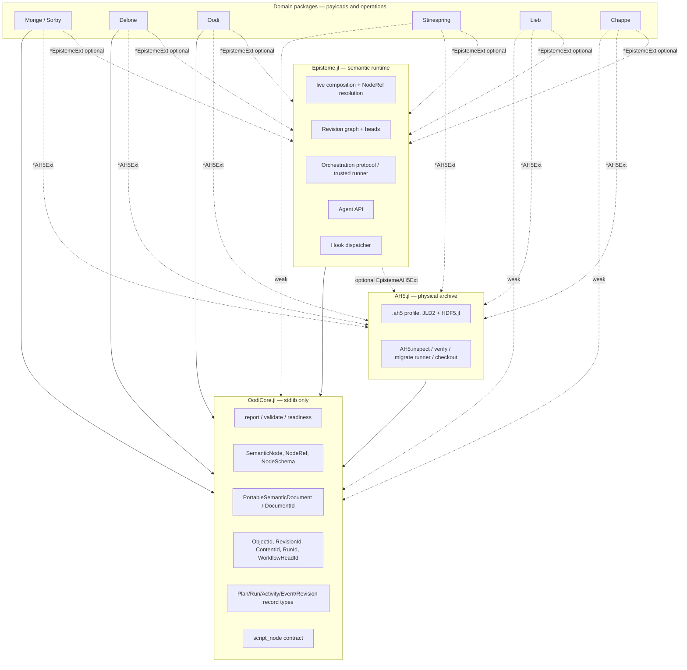
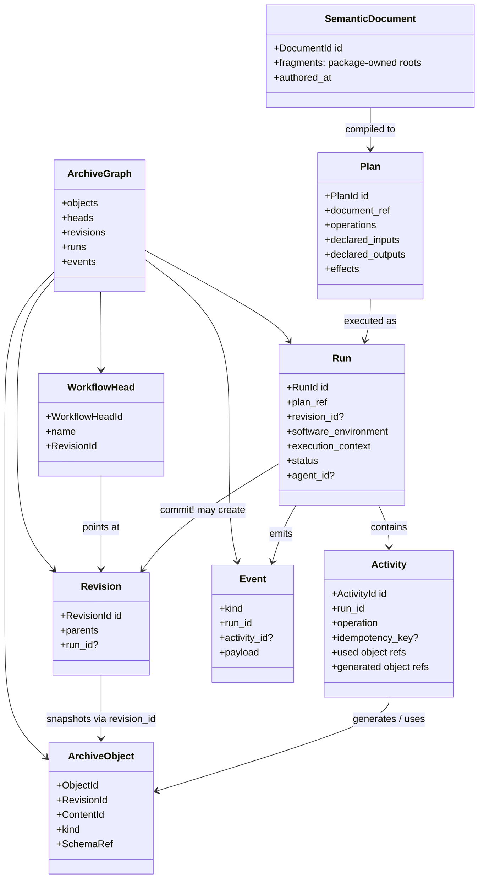
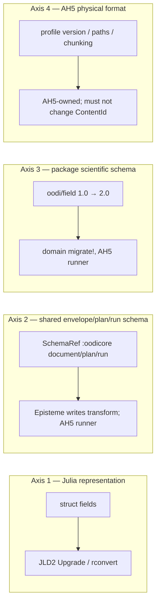
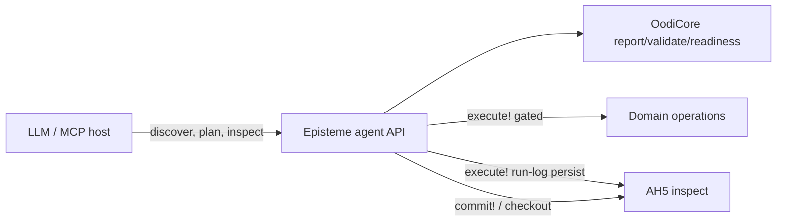

# Episteme Architecture Study

| Field | Value |
| --- | --- |
| Title | Long-term architecture for Episteme: a semantic runtime for scientific research |
| Author | Architecture study (issue [#48](https://github.com/ahojukka5/OodiCore.jl/issues/48)) |
| Date | 2026-08-19 |
| Status | Ready for acceptance |
| Decision | **REVISE** the working Episteme vision |
| Coordinates | [#47](https://github.com/ahojukka5/OodiCore.jl/issues/47) (JLD2/AH5 spike), [#24](https://github.com/ahojukka5/OodiCore.jl/issues/24) (AH5 epic), [#5](https://github.com/ahojukka5/OodiCore.jl/issues/5) (Loom / whole-model composition), [#25](https://github.com/ahojukka5/OodiCore.jl/issues/25)–[#26](https://github.com/ahojukka5/OodiCore.jl/issues/26), [#12](https://github.com/ahojukka5/OodiCore.jl/issues/12), [#34](https://github.com/ahojukka5/OodiCore.jl/issues/34) |
| Audience | Maintainers of OodiCore, AH5, and the domain packages (Monge, Sorby, Delone, Oodi, Stinespring, Lieb, Chappe) |

**Do not implement the Episteme rename or refactor until this document is accepted.**

---

## Overview

OodiCore today is a successful *contract package*: stdlib-only generics (`report`, `validate`, `readiness`), a Julia-native semantic tree, local declarative schemas, and a dependency-free archive envelope (`ObjectId`, `RevisionId`, `ContentId`, `WorkflowHeadId`). That is the right base. It is not a complete research runtime. Independently owned scientific packages still have no shared place to compose a whole-model document, record a run as inspectable history, decide whether an existing materialization can be reused, or expose a stable agent API.

The working mission is:

> Episteme.jl is a semantic runtime for composable, reproducible, and eventually autonomous scientific research.

This study pressure-tests that mission against primary documentation of data-versioning, experiment-tracking, workflow, provenance, schema, and migration systems, and against the already-decided Oodi ownership split (`docs/archive-ownership.md`, `docs/archive-envelope.md`) and the JLD2 spike (`research/jld2-ah5-spike/FINDINGS.md`).

**Decision: REVISE, do not naively ACCEPT, and do not REJECT.** The mission substance is right. The package topology is not “rename OodiCore to Episteme and absorb Loom.” OodiCore stays the forever-minimal, HDF5-free contract package and also owns portable/structural document *record types* (issue #5 option 1). A new `Episteme.jl` owns live composition, `NodeRef` resolution, and the orchestration *protocol*, superseding the separate Loom direction in issue #5. `execute!` records a run and, with AH5 loaded, persists that run log immediately; `commit!` is the only head-mover. `AH5.jl` remains the only physical archive implementation (`AH5.inspect` / `AH5.checkout`). Domain packages keep their payloads, schemas, codecs, and operations. “Eventually autonomous” is a destination, not a v1 feature.

---

## Background & Motivation

### Current state

`OodiCore.jl` already owns the pieces every Oodi product must share without loading CAD, mesh, FEM, HDF5, MPI, or a vendor runtime:

| Layer | What exists | Where |
| --- | --- | --- |
| Introspection generics | `report`, `validate`, `readiness` | `src/introspection.jl` |
| Semantic tree | `SemanticNode`, `NodeRef`; any Julia value is a legal attribute (#12) | `src/semantic_tree.jl`, `docs/semantic-tree-poc.md` |
| Local schemas | `NodeSchema`, `AttributeSchema`, `ValidationRule`, `NodeValidationRule` | `src/declarative.jl`, `docs/declarative-contracts.md` |
| Script contract | `script_node`; stored, never executed | same |
| Archive identities | `ObjectId`, `RevisionId`, `ContentId`, `RunId`, `WorkflowHeadId`, `SoftwareEnvironmentId`, `ExecutionContextId` | `src/archive_envelope.jl`, `docs/archive-envelope.md` |
| Envelope | `ArchiveObject`, `ArchiveReference`, `ArchiveGraph`, `WorkflowHead`, `SchemaRef`, `ProvenanceRefs` | same |
| Physical I/O | explicitly *not* here | `AH5.jl` (not yet created), `docs/archive-ownership.md` |

Issue #24 already describes the long-term scientific archive: append-only revisions, authored intent distinct from materialized objects, software-environment and execution-context fingerprints, checkout, capsules, migrations. Issues #27–#44 are the foundation contracts. None of that is a *runtime* that can compose Monge → Delone → Oodi, record a Stinespring QPU campaign, or answer an agent’s “what can I do with this mesh?”

### Pain points

1. **Composition has no owner.** Issue #5 preferred a dedicated Loom package so OodiCore would not grow orchestration. That split is now a liability: two future packages (Loom + Episteme) would both want the document root, the revision graph, and the agent API.
2. **Envelope is identity, not history.** `ArchiveObject.revision_id` names a workflow revision; parent/input edges are deferred to #30. There is no `Plan` vs `Run`, no activity record, no event stream, no reuse key.
3. **Two persistence capabilities are still conflated in conversation.** #12 allows arbitrary Julia values in the live tree. #34 wants a portable subset. #47 showed JLD2 can persist the rich tree *and* that JLD2 type metadata is not a scientific schema.
4. **Agents have generics but no lifecycle.** `report` / `validate` / `readiness` are read-only questions. There is no discover / plan / execute / inspect / branch / rerun / explain surface, and `script_node` still has no trusted runner.
5. **Domain packages must stay independent.** Monge, Delone, Oodi, Stinespring, Lieb, and Chappe must not depend on each other or load HDF5 on `using Package`. Any Episteme design that inverts that is rejected on sight.

### Why study other systems first

The tempting failure modes are well-represented in adjacent ecosystems: treat science as a file DAG (Snakemake/DVC), treat science as an ML experiment (MLflow/Sacred), treat science as RDF (Renku/PROV-O internally), or treat persistence as “pick a database.” This document exists so Episteme copies *mechanisms* and refuses *accidental ontologies*.

---

## Goals & Non-Goals

### Goals

- Decide the long-term package mission, name, and ownership split.
- Adopt a conceptual model that distinguishes authored intent, resolved plan, materialized domain objects, measured evidence, and derived analysis.
- Keep scientific objects (mesh, field, posterior, Hubbard sector, checkpoint) first-class, not as files produced by a shell stage.
- Make every committed execution inspectable history without turning every solver iteration into a revision.
- Keep `using OodiCore` and `using Episteme` free of HDF5, MPI, XML, and vendor SDKs.
- Align persistence with the #47 recommendation: JLD2 creates the `.ah5` file; HDF5.jl owns `/data`; Episteme schemas stay independent of JLD2 `_types`.
- Define a minimum agent API and a publication boundary (live archive / capsule / FAIR export).
- Produce an agent-sized PR epic that does **not** start a rename before this document is accepted.

### Non-goals

- Implement the Episteme refactor, rename OodiCore, or create the AH5.jl repository in this issue.
- Select PostgreSQL, MongoDB, or any other database “for backend generality.”
- Make RDF, JSON-LD, or RO-Crate the internal runtime representation.
- Copy ML-specific concepts (`Experiment`, `Model Registry` stages, `autolog`) when a general scientific concept exists.
- Force file-oriented DAG semantics onto semantic-object domains.
- Over-design secondary storage backends. AH5/HDF5 is the production persistence path.
- Execute user script source, sandbox arbitrary code, or ship a constraint solver.
- Qualify parallel HDF5/MPI in this document (that remains #29).
- Decide hash algorithms, exact HDF5 paths, or chunking (those remain #38 / #40 / #42).

---

## Key Decisions

These are the decisions this document commits to. Rationale and use cases follow in later sections.

| ID | Decision | Statement |
| --- | --- | --- |
| D1 | **REVISE** the vision | Accept the mission substance; reject “rename OodiCore” and “keep a separate Loom.” |
| D2 | Name | `Episteme.jl` is the semantic-runtime package. `OodiCore.jl` is not renamed. |
| D3 | Topology | Three layers: **OodiCore** (contracts + portable/structural document *record types*, issue #5 option 1), **Episteme** (live composition, `NodeRef` resolution, orchestration *protocol* — option 3), **AH5** (physical I/O). Domain packages own payloads. No process-global document root. |
| D4 | Loom | Issue #5 option 3 (dedicated composition package) is **superseded**. Episteme *is* that package, and it also owns the future orchestration *protocol*. Domain execution semantics stay in domain packages. Option 1 (structural document in OodiCore) is **kept**. |
| D5 | OodiCore forever-minimal | **Reaffirmed.** Stdlib only, no HDF5, no domain logic, no DAG resolution, no script execution, no migration *functions*. Archive *record types* and migration *identifiers* may grow; runners and file I/O may not. |
| D6 | Dual graph | History is **both** an immutable *state-snapshot* graph (`RevisionRecord`) **and** an *activity* graph (`RunRecord` / `ActivityRecord`), linked by generation/usage edges. Both live on `ArchiveGraph` (see D19). |
| D7 | Spec ≠ materialization | Authored `SemanticDocument` / `Plan` is a first-class object, distinct from resolved defaults, materialized domain objects, runtime evidence, and derived analysis. |
| D8 | Objects first | The unit of reuse and lineage is a scientific object (`ArchiveObject` + domain payload), not a task or a file path. |
| D9 | Revisions vs events | A `Revision` is a committed, checkout-able snapshot. Fine-grained solver steps, heartbeats, and logs are `Event`s inside a `Run`, not revisions. |
| D10 | Reuse is policy | Content identity + declared inputs + code/plan identity + *domain reuse policy* decide cache hits. Blind memoization is forbidden. Reuse **mints a new `ArchiveObject` row** (same `ObjectId` + `ContentId` + payload pointer, new `RevisionId`) on `commit!`; it must not alias the prior envelope row. Domain-owned `idempotency_key` (optional) is the only key for no-double-submit; match is archive-global `(kind, idempotency_key)`, never `WorkflowHeadId`. A missing key means “not idempotent”. |
| D11 | Two persistences | **Julia-native persistent** (JLD2, default for rich leaves) and **portable declarative** (#34, required for interchange/replay without the owning package). |
| D12 | Persistence stack | Adopt JLD2 **with constraints** from #47. JLD2 creates the file and owns `/_types`. HDF5.jl writes `/data`. Episteme schemas are independent of JLD2 type metadata. |
| D13 | Provenance collection | Kedro/Sacred-style hooks collect events without domain-dependency inversion. Domain packages declare *which* events are worth recording. |
| D14 | Export, not runtime | Internal model is Julia structs. RO-Crate and W3C PROV are export/import profiles, not the store. |
| D15 | Agent API | Read-only: `discover`, `report`, `validate`, `readiness`, `plan`, `inspect`, `explain`. Mutating: `execute!`, `commit!`, `branch!`, `rerun!`. `inspect` is a lazy in-memory/manifest API (no HDF5). Payload `checkout` is `AH5.checkout` / `EpistemeAH5Ext` only. |
| D16 | Publication | Three products: live working archive (`.ah5`), reproduction capsule (#35), FAIR research-object export (RO-Crate + PROV). Capsules that need Julia-native `/packages` declare `:trusted_code_required` in `readiness`. |
| D17 | Autonomous is later | “Eventually autonomous” does not authorize implicit script execution, unconstrained tool use, or an agent that commits revisions without a human- or policy-gated head. |
| D18 | Execute vs commit | `execute!` records a `Run` + `Activity`s + `Event`s and never moves a head. `commit!(head, run)` is the only head-mover and the only creator of a `RevisionRecord`. Default `CommitPolicy` is `:explicit` (agents/interactive); `:auto` is an opt-in for batch. Failed runs never create a revision unless an explicit failed-commit policy is set. **Persist is split:** with `EpistemeAH5Ext` loaded, `execute!` appends the run log (runs, activities, events, idempotency index, optional run-attached evidence bytes) to the live `.ah5` immediately. `commit!` promotes staged snapshot payloads into `graph.objects` as new envelope rows and moves the head. A live archive may contain runs with `revision_id === nothing`. Without AH5, the same facts exist only in the in-memory `ArchiveGraph` (core `using Episteme` stays HDF5-free). |
| D19 | ArchiveGraph is the container | `ArchiveGraph` gains `revisions`, `runs`, and `events` vectors next to `objects` and `heads`. Object-set of a revision is derived (`find_objects`); `RunRecord.revision_id` may be `nothing`. The same `ObjectId` may appear under many `RevisionId`s as distinct `ArchiveObject` rows that share a `ContentId`. Plans and portable documents are ordinary `ArchiveObject`s under namespace `:oodicore` / kinds `oodicore/document` and `oodicore/plan`. |
| D20 | Axis-2 writer | Shared envelope/plan/run schema *transforms* are written in Episteme (or AH5 for physical-adjacent records) and push-registered with the AH5 runner. OodiCore stores `SchemaRef` + compatibility + migration identifiers only. Namespace for those schemas is `:oodicore`. |

---

## Proposed Design

### 1. Revised mission

Working statement, kept:

> Episteme.jl is a semantic runtime for composable, reproducible, and eventually autonomous scientific research.

Refined operational reading:

> Episteme.jl composes independently owned scientific packages into one inspectable research document, records immutable revisions of what was intended and what was realized, and exposes a trusted execution protocol that agents can drive. It does not own CAD, mesh, FEM, QPU, Hubbard, or LLM semantics, and it does not open HDF5 files in its core `using` path.

“Autonomous” means: an agent can discover capabilities, propose a plan, execute allowed operations, inspect evidence, and branch history *using the same contracts a human uses*. It does not mean Episteme executes untrusted source or invents domain operations.

### 2. Package topology (supersedes “minimal OodiCore is the product” and separate Loom)



Allowed edges (extends `docs/archive-ownership.md`):

```text
domain          -> OodiCore          (hard or weak)
Episteme        -> OodiCore          (hard)
AH5             -> OodiCore          (hard)
domain          -> Episteme          (optional/weak + *EpistemeExt; composition only)
domain          -> AH5               (weak + *AH5Ext)
Episteme        -> AH5               (weak + EpistemeAH5Ext)
AH5XDMFExt      -> AH5 + XML
AH5MPIExt       -> AH5 + MPI
```

Forbidden edges:

```text
OodiCore        -> Episteme / AH5 / HDF5 / XML / MPI / any domain
AH5             -> Episteme / any domain
Episteme core   -> HDF5 / JLD2 / MPI / XML / vendor SDK
domain A        -> domain B          merely to compose or read identities
```

**What this supersedes.** Issue #5’s preferred option 3 (a Loom package that owns the document root *and* resolution) is absorbed into Episteme. The *reason* for option 3 — OodiCore must not own CAE execution order or `NodeRef` resolution — is kept. The extra package name is not. A future “Loom” brand, if anyone still wants it, is an Episteme facade, not a fourth layer.

**What this keeps from issue #5 option 1.** OodiCore owns a narrowly structural, serializable document envelope (`DocumentId`, `PortableSemanticDocument`, fail-closed capture). That type has no resolution, no execution order, and no process-global root. Git-diffable form is the portable document (and its S-expr view). JLD2 persist is not Git-diffable and is not the interchange contract.

**What this reaffirms.** `AGENTS.md` §4–§5 and `docs/archive-ownership.md`: OodiCore stays safe as a base dependency from Chappe’s provider-free path and Lieb’s core CI. Archive *record types* for Plan/Run/Activity/Event/Revision and portable documents may be added to OodiCore because they are the same kind of domain-neutral data as `RevisionId`. Runners, hook dispatch that executes domain code, `NodeRef` resolution, and document evaluation live in Episteme. Migration *functions* never live in OodiCore.

### 3. Conceptual model and vocabulary

Types below are *logical*. Exact Julia structs are a later PR. Existing OodiCore names are reused, not duplicated.



| Term | Meaning | Already in tree? | PROV mapping (export only) |
| --- | --- | --- | --- |
| **Semantic document** | Authored package-fragment forest. Exact intent. Not a mesh. Live composition is Episteme; the portable envelope is OodiCore (#34). | `SemanticNode` forest; `PortableSemanticDocument` is #34 | `prov:Entity` (plan-like) |
| **Plan** | Resolved, validated, executable recipe derived from a document (or from an explicit API call). Defaults bound. Still not a result. Stored as `ArchiveObject` kind `oodicore/plan`. | new record type in OodiCore | `prov:Plan` / `prov:Entity` |
| **Operation** | One domain-owned step in a plan (`monge/extrude`, `delone/mesh`, `oodi/solve`, `stinespring/acquire`, `lieb/lanczos`, `chappe/benchmark`). | domain package | activity type |
| **Run** | One execution of a plan (or of an ad-hoc operation sequence). Has status, software env, execution context. | `RunId` exists; record does not | `prov:Activity` (bundle) |
| **Activity** | One operation instance inside a run. Uses and generates objects. | new | `prov:Activity` |
| **Domain object** | Live Julia value owned by a package (`Mesh`, `Field`, `Posterior`, `HubbardSector`). | package types | — |
| **Archive object** | Envelope of one object *version*: ids, kind, schema, references. Payload stays with the package codec. | `ArchiveObject` | `prov:Entity` |
| **Content** | Logical bytes/identity independent of HDF5 layout. | `ContentId`; hash rules #42 | entity specialization |
| **Artifact** | Stored content that may be embedded (`/data`) or external (content-addressed pointer). Includes debug/derived (#32). | planned | `prov:Entity` |
| **Revision** | Immutable global workflow snapshot. Several objects may be materialized in it. | `RevisionId`; parent edges #30 | snapshot of entities |
| **Workflow head** | Movable bookmark / branch / alias pointing at a `RevisionId`. | `WorkflowHead` | — (not PROV) |
| **Event** | Append-only timeline fact inside a run (heartbeat, log line, checkpoint mark, hook firing). Not a revision. | #44 record types | optional |
| **Agent** | Human, package, or LLM session responsible for a run. Identified by optional `AgentId` on `RunRecord`. | new optional id | `prov:Agent` |

Identity rules already in `docs/archive-envelope.md` stay law:

- `ObjectId` is archive-global, opaque, not namespaced.
- Equal byte strings of different id types are not equal (`object != content` even when `object.value == content.value`).
- `kind` is package-qualified (`delone/mesh`) and owned by the object’s namespace.
- `SchemaRef` is exact; compatibility is declared, never inferred from SemVer.
- Unpinned `ObjectRef` means “any version of this object”; scientific dependencies pin a `RevisionId`.

### 3.1 `ArchiveGraph` is the dual-graph container

Today `ArchiveGraph` is only `objects::Vector{ArchiveObject}` plus `heads::Vector{WorkflowHead}` (`src/archive_envelope.jl`). Objects already carry `revision_id` and optional `run_id`. The dual graph does **not** live in a parallel Episteme-only session. It extends the existing envelope type:

```julia
# conceptual additive fields; insertion order is not authoritative
struct ArchiveGraph
    objects::Vector{ArchiveObject}       # existing
    heads::Vector{WorkflowHead}          # existing
    revisions::Vector{RevisionRecord}    # new; snapshot nodes
    runs::Vector{RunRecord}              # new; may exist with no revision
    events::Vector{EventRecord}          # new; append-only, not revisions
end
```

There is no separate `ArchiveSession`. Episteme holds an in-memory `ArchiveGraph` and optionally persists it through `EpistemeAH5Ext`. AH5 does not grow a second graph.

**Invariants** (`validate(graph)` must report violations):

| Invariant | Rule |
| --- | --- |
| Revision exists | Every `ArchiveObject.revision_id` names a `RevisionRecord` in `graph.revisions`. |
| Object set is derived | The object set of a revision *is* `find_objects(graph, revision_id)`. `RevisionRecord` does **not** store a duplicated object-id list. Dual bookkeeping is forbidden. |
| Head target | Every `WorkflowHead.revision_id` names a `RevisionRecord`. |
| Run without snapshot | A `RunRecord.revision_id` may be `nothing` (failed, still running, or not-yet-committed). That run and its events remain in the graph **and**, when AH5 is loaded, in the live `.ah5`. Uncommitted history is not process-local. |
| Run with snapshot | If `revision_id` is set, that `RevisionRecord.run_id` is this run (or a listed producing run). |
| Parent DAG | `RevisionRecord.parents` is a list of `RevisionId`s present in `graph.revisions`. Cycles and dangling parents fail (`:cycle`, `:dangling_parent`). Parents are revision edges, not object edges. |
| Activity belongs to a run | Every `ActivityRecord.run_id` names a `RunRecord`. Events optionally name an activity. |
| Kind/namespace | `kind` is owned by `namespace` (existing rule). |
| Reuse is a new row | The same `ObjectId` may exist in many revisions. Each pair `(ObjectId, RevisionId)` is its own `ArchiveObject`. Reuse copies `ObjectId`/`ContentId`/payload pointer into the run staging set; `commit!` writes a **new** envelope row with the new `RevisionId`. Aliasing the old row is forbidden (`:reused_object_not_in_revision` if a committed revision’s `find_objects` misses a generated `ObjectId`). |

**Plans and documents are ordinary `ArchiveObject`s**, not a second envelope class:

| Kind | Namespace | Schema | Payload |
| --- | --- | --- | --- |
| `oodicore/document` | `:oodicore` | `SchemaRef(:oodicore, "document", version)` | `PortableSemanticDocument` (portable) or a Julia-native tree (JLD2) |
| `oodicore/plan` | `:oodicore` | `SchemaRef(:oodicore, "plan", version)` | `Plan` record (`to_namedtuple`) |

OodiCore owns those kinds and schemas. Episteme compiles a live forest into a `Plan` and may persist both as archive objects. If Episteme is abandoned, the record types and portable document remain useful to AH5.

`RevisionRecord` itself is metadata, not an `ArchiveObject`. It is the snapshot node: `id`, `parents`, optional `run_id`, optional `plan_id`. Its object versions are queried, not stored twice.

### 4. Canonical relationships (architecture question 4)

```text
SemanticDocument  --compile/validate-->  Plan
        |                                  |
        |  both stored as ArchiveObjects   |
        |  kinds oodicore/document,        |
        |       oodicore/plan              |
        v                                  v
   authored intent                  resolved recipe
                                           |
                                           | execute!   (records Run + Events;
                                           |             does not move a head)
                                           v
                                         Run
                                      /    |    \
                             Activity  Event   diagnostics
                              /    \
                           used    generated
                              \    /
                    uncommitted object versions
                                           |
                                           | commit!(head, run)   [explicit]
                                           v
                           ArchiveObject@Revision
                                   |
                            WorkflowHead moves here
                                   |
                    postprocess: new execute! then commit!
                                   |
                    publish: capsule and/or RO-Crate
```

Concrete bindings:

| Concept | Monge | Delone | Oodi | Stinespring | Lieb | Chappe |
| --- | --- | --- | --- | --- | --- | --- |
| Document fragment | `monge/box` tree | `delone/model` | `oodi/poisson` spec | measurement-config + program | lattice/sector spec | serving/benchmark campaign |
| Domain object | reconstructable solid | `Mesh` | `Field`, solver state | posterior, raw shots | `HubbardSector`, Krylov state | checkpoint identity, cost surface |
| Activity | extrude, boolean | mesh, adapt | assemble, solve | acquire, infer | Lanczos step *batch* (not every iteration) | benchmark, search trial |
| Evidence | BREP / visualization projection | quality report | residual history | raw QPU shots (immutable) | eigenpairs, timings | latency/cost measurements |
| Derived | — | hierarchy | postprocessed field | updated posterior | sweep table | ranking / chosen config |

A Stinespring raw shot record is **evidence**. A posterior update is a **new archive object** in a **new revision**, derived from that evidence. The shots are never overwritten. That is the same pattern as Oodi keeping the residual history while postprocessing writes a derived field.

### 5. Dual history graph (architecture question 5)

**Both, linked.** Neither graph alone is enough.

| Graph | Node | Edge | Answers | Must not become |
| --- | --- | --- | --- | --- |
| **Snapshot** | `Revision` | parent / merge-parent (#30, Alembic/Git/lakeFS) | “What was the world at this checkout?” | a commit per Newton iteration |
| **Activity** | `Run` / `Activity` | used / generated / informed-by (PROV) | “What happened, who did it, with what env?” | a knowledge-graph runtime |

Linkage:

- `execute!` never produces a `Revision`. A later `commit!(head, run)` *may* create one and move the head (D18).
- A failed run stays in `graph.runs` with `revision_id === nothing` unless an explicit failed-commit policy is set. With `EpistemeAH5Ext`, that row is appended to the live `.ah5` at `execute!` time (lakeFS uncommitted staging vs committed snapshot, **both durable**).
- `ArchiveObject.revision_id` is the snapshot that contains that object version (already specified). Uncommitted *snapshot payloads* produced by a run that has not been committed are **not** in `graph.objects` yet. They sit in a run-local staging set that `commit!` promotes into new `ArchiveObject` rows. Staging is not a second archive schema; with AH5, run-attached evidence bytes (e.g. Stinespring shots that must survive a crash) may be stored under a run-scoped path, still without a `RevisionId`.
- Reuse / idempotent replay copies `ObjectId` + `ContentId` + payload pointer into that staging set. It does **not** attach the prior `ArchiveObject` (that row’s `revision_id` is the old snapshot). `commit!` writes a new envelope row so `find_objects(graph, new_revision)` includes the reused object.
- `ArchiveObject.run_id` (already optional on the envelope) points at the producing run. On a reuse row it may point at the run that *reused* it; the activity’s `generated` refs may still name the prior version as the reuse source.
- `Activity` records the generating operation, used object versions, and optional `idempotency_key`.
- `inspect` walks the in-memory graph (manifest, no HDF5). `AH5.checkout` (#33) walks the snapshot graph and may load `/data`. Explain/rerun walk the activity graph. Idempotency lookup walks durable `ActivityRecord`s in the archive, not the current head.

lakeFS/Git teach: branches are pointers, commits are immutable, merge is explicit. Alembic teaches: migration history is itself a DAG with merge revisions, and upgrade/downgrade are named, not inferred. Episteme revisions follow that, not MLflow’s mutable “latest run in experiment.”

### 6. Lifecycle: intent → publication

```mermaid
sequenceDiagram
    participant H as Human or agent
    participant E as Episteme
    participant D as Domain package
    participant AH as AH5 (optional)
    participant X as Export

    H->>E: author / load SemanticDocument
    E->>E: validate(document, local schemas)
    E->>D: domain validate / readiness
    E->>E: compile Plan (bind defaults, resolve NodeRefs)
    Note over E: authored document remains an immutable object
    H->>E: execute!(plan)  # does not move head
    E->>E: before_run hooks (env fingerprint, policy)
    loop each operation
        E->>E: reuse / idempotency check (archive-global kind+key)
        alt cache hit or idempotent replay
            E->>E: stage ObjectId+ContentId copy (do not alias old envelope row)
        else compute
            E->>D: run operation
            D-->>E: domain object + diagnostics
            E->>E: after_activity hooks
            E->>E: stage new payload identity
        end
        E->>E: append Events (not revisions)
    end
    Note over E: Run + Events in ArchiveGraph; head unchanged
    opt AH5 loaded
        E->>AH: append runs / events / idempotency index / run-attached evidence
        Note over AH: still no RevisionRecord; objects not promoted
    end
    alt CommitPolicy :explicit (default)
        H->>E: commit!(head, run)
    else CommitPolicy :auto (batch opt-in)
        E->>E: commit!(head, run)
    end
    E->>E: create RevisionRecord; mint new ArchiveObject rows; move WorkflowHead
    opt AH5 loaded
        E->>AH: append objects / revision / head
    end
    opt publish
        E->>X: capsule and/or RO-Crate + PROV
    end
```

Stages that must remain distinguishable (acceptance criterion):

| Stage | Stored as | Example |
| --- | --- | --- |
| Authored intent | portable or Julia-native `SemanticDocument` object | Oodi Poisson spec as typed |
| Resolved plan | `Plan` object (defaults filled, refs resolved) | mesh size default 0.1 bound |
| Materialized state | domain `ArchiveObject`s in a `Revision` | Delone mesh, Oodi field |
| Measured evidence | evidence-kind objects, immutable | Stinespring shots, Chappe latency table |
| Derived analysis | new objects, new revision, pinned inputs | postprocessed flux; Lieb sweep plot |

Checkout/debug/replay: `branch!(head, from::RevisionId)` is HDF5-free (it only writes a `WorkflowHead` pointer). Payload `checkout` is AH5. A failed run keeps its `Run` + `Event`s with `revision_id === nothing` **in the graph and, if AH5 is loaded, on disk**; the operator can `branch!` from the last good revision and `rerun!` from a named activity, Metaflow-style, without inventing a revision per event. `rerun!` is `execute!` from an activity; it still does not move the head until `commit!`. Idempotency still matches archive-global `(kind, idempotency_key)` after `branch!`.

### 7. What Episteme owns vs what domains own (architecture question 3)

| Episteme-owned | Domain-owned | AH5-owned | OodiCore-owned |
| --- | --- | --- | --- |
| Live document composition, `NodeRef` resolution across fragments | Payload types and scientific meaning | `.ah5` profile, HDF5 encoding | Generic functions, tree, local schemas, id types |
| Plan compilation from a document | Operation implementations + `register_operation!` | JLD2/HDF5 writers, `/data` | `DocumentId`, `PortableSemanticDocument`, Plan/Run/Activity/Event/Revision *record types* |
| Orchestration protocol, trusted script runner | Domain constraints / equations | Migration *runner* | Schema-status vocabulary, migration *identifiers* |
| Hook dispatch, event schema | Which events are worth recording | Integrity hash compute (#42) | Content-hash *rules* as data |
| Revision graph mechanics, heads | Schema migration *functions* (payload) | Codec registry, `AH5.inspect`, `AH5.checkout` | Envelope, `ArchiveGraph` |
| Reuse-key assembly + policy gate | Reuse *policy* and `idempotency_key` | Parallel I/O extension | `script_node` contract (no exec) |
| Shared envelope/plan/run schema *transforms* (registered with AH5) | XDMF projection recipes | XDMF writer | — |
| Agent API (`inspect` = lazy manifest), `explain` | Package-specific crate profiles | Capsule packaging (#35) | Capsule *manifest types* |
| RO-Crate/PROV export mapping | | | |

Use case: Oodi must not import Delone to know what a mesh is; it receives an `ObjectRef` to a `delone/mesh` and asks Delone (if loaded) or `AH5.inspect` (if not) for the contract. Episteme resolves the reference. Delone’s mesh operator decides whether a previous mesh is reusable when only a far-away hole moved (probably not) versus when only a material label changed (maybe).

### 7.1 Push registry, `OperationSpec`, and activity grain

Domains register operations the same way they will register AH5 codecs: **push from `*EpistemeExt.__init__`**, never pulled by Episteme importing the domain. Domain→Episteme remains optional/weak so Chappe/Lieb core CI can stay Episteme-free.

```julia
# conceptual; lives in Episteme, called from MongeEpistemeExt.__init__
register_operation!(
    kind::Symbol;                          # e.g. Symbol("monge/extrude")
    compile::Function,                     # node/plan fragment -> OperationSpec
    reuse_equivalent = nothing,            # (spec, candidate) -> Bool
    events = (),                           # event kinds this op may emit
    default_reuse = :forbid,
    fragment_roots = (),                   # node kinds this package owns as roots
)
```

`OperationSpec` is data, not a closure:

```julia
struct OperationSpec
    kind::Symbol
    inputs::Vector{Symbol}                 # named roles (:geometry, :mesh)
    outputs::Vector{Symbol}
    effects::Tuple{Vararg{Symbol}}         # :pure, :filesystem, :network, :qpu, ...
    default_reuse::Symbol                  # :forbid | :allow_if_domain_says | :force_recompute
    idempotency_key::Union{Nothing,String} # domain-provided; nothing => not idempotent
end
```

**Activity grain.** The domain chooses what one `Activity` is. Episteme never infers solver iterations as activities. Lieb’s Lanczos *batch* (or “until checkpoint”) is one activity; inner iterations are `Event`s or solver-owned history. Stinespring acquire is one activity per declared job, keyed by `idempotency_key` (program hash + job id), not by a fresh `ActivityId`. A missing `idempotency_key` means a second `execute!` is a new job.

**Idempotency match.** Archive-global `(kind, idempotency_key)` against durable `ActivityRecord`s already in the archive (including runs with `revision_id === nothing`). Optionally narrowed by `plan_id` or document id when the domain declares the key is plan-scoped. **Never** by `WorkflowHeadId`: a `branch!` must not make the same QPU acquire look new. Episteme then asks the domain callback whether the physical side-effect already happened. It never infers QPU identity. A new `ActivityId` is minted for bookkeeping even on an idempotent replay. The current head only selects *where* a later `commit!` would point.

**Fragment roots.** `fragment_roots` is how `plan(document)` discovers package fragments without importing every domain. Unregistered kinds stay as opaque `SemanticNode`s; compile fails with `:unknown_operation` rather than guessing.

### 8. Candidate ideas A–H, evaluated

| Idea | Verdict | Rationale | Ecosystem use case |
| --- | --- | --- | --- |
| **A. Spec ≠ materialization** | **Adopt** | DVC `dvc.yaml` vs `dvc.lock`, Renku Plan vs Run. Exact authored intent must remain recoverable. | Oodi Poisson document stays inspectable after the solve; resolved quadrature defaults live on the Plan, not silently in the Field. |
| **B. Objects/assets first-class** | **Adopt** | Dagster assets beat task DAGs for our domains. A mesh has identity independent of the command that built it. | Delone mesh `ObjectId` is reused by Oodi and by a later adaptation revision; the meshing activity is provenance, not identity. |
| **C. Every execution is inspectable history** | **Adopt, scoped** | Metaflow/Sacred strength. Scope: every *Run* and committed *Activity*, not every Krylov iteration. | Stinespring can open last week’s acquire run: program, shots, calibration, failure, env. Lieb Lanczos inner iterations are Events or solver-owned history, not Episteme revisions. |
| **D. Immutable revisions + movable heads** | **Adopt** (already started) | lakeFS/Git/Alembic. Keep `RevisionId` / `WorkflowHead`. Add parent/merge edges (#30) and aliases. | Chappe architecture-search branches from a historical checkpoint revision without copying weights. |
| **E. Content identity and reuse** | **Adopt with policy gate** | DVC run-cache, Nextflow hash, Snakemake Merkle cache. Scientific correctness ≠ memoization. | Re-meshing after a cosmetic CAD rename should reuse; re-solving after a PETSc options change must not, even if the matrix bytes match. |
| **F. Rich Julia + portable capability** | **Adopt** (#47/#34/#12) | Do not flatten `SemanticNode` to JSON to persist it. Portable is a capability. | Dual-number parameters in a live Monge tree persist via JLD2; the interchange document stores the primal floats + a declared AD mode, not the dual type. |
| **G. Generic event lifecycle** | **Adopt** | Kedro hooks, Sacred observers. Prevents Episteme from importing Oodi to log residuals. | `after_activity` records an Oodi residual snapshot only if Oodi registered that event kind. |
| **H. Standards-compatible export** | **Adopt as export** | RO-Crate 1.2 + PROV-DM. Internal runtime stays Julia structs. | A published Lieb paper supplement is an RO-Crate; the working archive stays `.ah5`. |

### 9. Automatic provenance vs explicit domain semantics (architecture question 6)

Two channels, never mixed:

1. **Automatic, structural.** Episteme records: plan id, run id, activity id, start/stop, status, software-environment id (#37), execution-context id (#43), used/generated `ObjectRef`s, hook names that fired, declared script effects. This is always available if a run happened. It does not know what a residual is.
2. **Explicit, domain.** Domain packages attach named `ArchiveReference`s (`:geometry`, `:mesh`, `:prior`) and optional event payloads (`oodi/residual-sample`). They register hook implementations the same way they register AH5 codecs: push from `*EpistemeExt` / `*AH5Ext`, never pulled by importing the domain.

Missing domain semantics is not filled in by guessing. Episteme `inspect` prints envelope fields and event kinds. `AH5.inspect` does the same from a file with no domain package. Interpreting a posterior requires `using Stinespring`.

Hook specification (names are data, Kedro-style):

```text
after_context_created
before_plan_compile / after_plan_compile
before_run / after_run / on_run_error
before_activity / after_activity / on_activity_error
before_commit / after_commit
before_object_store / after_object_store
```

`ParallelRunner`-class warning from Kedro applies: hooks that must fire next to a distributed solver live in the rank-0 protocol, not in every worker.

### 10. Schemas vs Julia type identity (architecture question 7)

| Value class | Identity | Schema required? | Persist how |
| --- | --- | --- | --- |
| Envelope records (`ObjectId`, `SchemaRef`, …) | Julia type + field values | Yes, embedded Episteme schema | Always portable (`to_namedtuple`) |
| Local declarative nodes (`NodeSchema` trees) | kind + attributes | Yes (`NodeSchema`) | Portable if leaves are portable |
| Domain scientific payloads | package `kind` + `SchemaRef` | **Yes** — this is the scientific contract | Julia-native by default; portable codec optional |
| Rich live leaves (duals, custom structs) | Julia type | No Episteme schema | JLD2; reject handles/ptrs/comms |
| Bulk arrays | `ContentId` + `LogicalArraySpec` | Logical spec yes; physical layout no | HDF5.jl `/data` |
| Unsafe (MPI comm, IO, GPU array, closure, task, provider client) | — | — | **Reject at codec boundary** (#47) |

JLD2 `Upgrade` / `typemap` reconstructs a Julia struct. It does not answer “did `lieb/hubbard-sector` change meaning?” That remains `SchemaRef` + #41.

### 11. `using Episteme` vs extensions (architecture question 10)

| Always in `using Episteme` | Extension / backend |
| --- | --- |
| Depends on OodiCore only (plus stdlib) | `EpistemeAH5Ext` — persist run log on `execute!`; persist objects/revision/head on `commit!`; `AH5.checkout` |
| Plan compile, in-memory `ArchiveGraph`, live composition | `EpistemeMPIExt` — if any (prefer AH5MPIExt) |
| Hook dispatcher, agent API (in-memory) | RO-Crate/PROV exporter (optional dep) |
| Trusted runner *protocol* (no default eval of untrusted source) | Language runners (`JuliaRunner` may live here but must be explicit) |
| Revision graph in RAM | Heavy plot/report renderers |

`using Episteme` must be as safe as `using OodiCore` for Chappe/Lieb core CI: no HDF5, no JLD2, no HTTP, no provider SDK.

### 12. Publication / reproduction boundary (architecture question 11)

```text
Live working archive (.ah5)
    complete history, purgeable debug, lazy checkout
        |  select revision + policy
        v
Reproduction capsule (#35)
    self-contained, truthful readiness: inspect / replay / restart / rerun
        |  publish
        v
FAIR research object (RO-Crate 1.2 + PROV)
    files + contextual entities (people, software, equipment, workflow)
    not a second runtime
```

- **Live archive** is the lab notebook. It may contain purgeable debug (#31, #32) **and uncommitted runs** (`revision_id === nothing`) so a crash or a colleague opening the file still sees the last acquire.
- **Capsule** is what you send a colleague to *rerun* a revision. It must not claim replay if a QPU job or a missing external checkpoint cannot be replayed; `readiness` tells the truth. Capsules whose `/packages` payloads need full JLD2 load (not `plain`) must report `:trusted_code_required` and name the allow-listed packages. Forensic/generic inspect of a capsule always uses `plain` / HDF5 names. Trusted replay is policy-gated and runs only after integrity hashes (#42). A denylist on *our* writer does not protect a capsule written by someone else.
- **RO-Crate** is what you attach to a paper. Workflow + software + evidence + PROV activities. Internal heads, hook traces, and JLD2 `_types` need not appear.

Stinespring: raw shots can go in the live archive and the capsule; a cloud-QPU token never does. Chappe: benchmark tables go in the crate; a 70B weight file is an external content-addressed artifact, not a crate payload.

---

## Comparison matrix

Cells are deliberately short. See the per-system notes for citations and “steal / avoid.”

Legend for system groups: **V** versioning, **T** tracking, **W** workflow, **P** provenance/standards, **S** schema/migration, **J** JLD2/#47.

### 1–5. Source of truth through version model

| System | 1. Source of truth | 2. Identity model | 3. Intent vs execution | 4. Data model | 5. Version model |
| --- | --- | --- | --- | --- | --- |
| **DVC** | Git-tracked `dvc.yaml` + content-addressed cache; `dvc.lock` is realized state | Stage name; file md5/etag; artifact id | **Yes**: yaml (intent) vs lock (hashes, expanded foreach) | Files, params, metrics, plots; command stages | Git commits of metadata; data in cache; exp branches |
| **lakeFS** | Immutable commits over object store; branch = pointer + uncommitted staging | Repo / commit-id (content digest) / branch / tag / lakefs URI | Weak: commit message + hooks; no workflow spec | Objects (files) in a repo; format-agnostic | Git-like commit/branch/merge/revert; zero-copy branch |
| **DataLad** | Git dataset + git-annex keys; run records in commits | Dataset id; annex key; commit | Partial: `datalad run` records cmd+I/O; no separate plan type | Files; nested datasets | Git history; annex decouples availability from identity |
| **Pachyderm** | PFS commits; pipelines fire on data | Repo, commit, branch, datum, pipeline | Spec (pipeline) vs output commits | Files in versioned repos | Immutable commits; data-triggered new commits |
| **MLflow** | Tracking backend (files/DB) + artifact store | `experiment_id`, `run_id`, `model_id`, registry name/version/alias | Weak: code logs params; no first-class spec object | Params, metrics, tags, artifacts, logged models | Mutable experiment collection; model versions + aliases |
| **Metaflow** | Metadata provider (local or service) + datastore | `Flow/Run/Step/Task/DataArtifact` pathspec; artifact sha | Flow code is spec; Run is realization | Language-native Python artifacts | Runs are immutable; `origin_pathspec` on resume; tags mutable |
| **Sacred** | Observer backend (Mongo/files) | Experiment name + run `_id` | Config is first-class; main is code | JSON-ish config; resources; artifacts; metrics series | Runs append-only; config is a snapshot |
| **Dagster** | Code-defined assets | Asset key; materialization; `code_version` | **Yes**: asset def vs materialization | Tables/files/models as assets | Materialization history; not a full data VCS |
| **Kedro** | Pipeline + DataCatalog YAML | Logical dataset name | Node/pipeline is spec; catalog is binding | Datasets behind catalog; nodes are functions | Catalog versioning optional; no native revision DAG |
| **Snakemake** | Snakefile (code-as-DAG) | File paths + wildcard jobs | Rule is spec; files are realization | Files; params via `params` | Filesystem mtime/presence; optional cache |
| **Nextflow** | Script + config; work dir + `.nextflow/cache` | Session id + task hash | Process is spec; work dir is realization | Channels of files/values | Resume by hash; lineage LIDs (recent) |
| **Renku** | Project + Knowledge Graph | Plan id; Run id; file paths | **Yes**: Plan (recipe) vs Run (execution) | Files + KG metadata | Git + KG; rerun from plan |
| **RO-Crate** | `ro-crate-metadata.json` + payload files | `@id` IRIs; root dataset | Crate is a *package*, not a runtime | Data + contextual entities (schema.org) | Crate versions via Create/UpdateAction; not a VCS |
| **W3C PROV** | Provenance records (any serialization) | Qualified names for entity/activity/agent | Plan is extended PROV; core is *what happened* | Entity / Activity / Agent graph | Revision is a derivation subtype; not storage |
| **Pydantic** | Type-annotated models | Model fields; JSON Schema `$id` optional | Schema is intent; instance is data | Python objects ↔ JSON-ish | Model version is application-owned |
| **SQLAlchemy** | Mapped classes + `Table` | Identity map / PK | In-memory vs persistence mapping | Rows, relationships | App-owned; identity map not history |
| **Alembic** | `versions/` scripts + `alembic_version` table | `revision` / `down_revision` / `branch_labels` | Script is intent; DB state is realization | DDL ops | Explicit revision DAG, branches, merge revisions |
| **JLD2 / #47** | HDF5 file + JLD2 `_types` | Julia type + path; not scientific id | None (codec only) | Arbitrary Julia (safe subset) | `Upgrade`/`typemap` for struct shape, not meaning |

### 6–10. Provenance through schema evolution

| System | 6. Provenance | 7. Storage | 8. Execution | 9. Reuse | 10. Schema / migration |
| --- | --- | --- | --- | --- | --- |
| **DVC** | deps/outs/params hashes; Git user; not hardware/RNG | Content-addressed cache + remotes; Git for meta | Task/stage DAG (`dvc repro`) | Run cache by stage signature; skip unchanged | Cache migrate cmd; no scientific schema |
| **lakeFS** | Commit metadata; hooks; not process graph | Metadata KV + immutable objects in S3/etc. | None (storage control plane) | Zero-copy branch; no compute cache | Format-agnostic; GC of unreferenced objects |
| **DataLad** | `run` record: cmd, inputs, outputs, dataset id | Git + annex (content optional) | Imperative `run`; `rerun` | Recompute, not memoize | Dataset/annex; no payload schema |
| **Pachyderm** | Automatic commit lineage across pipelines | PFS on object store; k8s | Data-triggered container pipelines | Incremental by changed datums | None scientific |
| **MLflow** | Run → params/metrics/artifacts; model lineage to run | Backend store + artifact store split | Not an orchestrator | None (search, not cache) | Model signature; no migration DAG |
| **Metaflow** | Code package, env info, artifacts, logs, exception | Local or service metadata + datastore | Imperative steps, foreach, resume | Resume clones successful steps | Artifacts are pickle-ish; evolution ad hoc |
| **Sacred** | Sources+md5, git dirty, deps, host info, seed, config | Mongo or files; 16 MB doc pitfall | `@ex.main` + observers | None | Config JSON constraints |
| **Dagster** | Asset lineage, materializations, observations | External stores; Dagster event log | Asset graph; ops hidden | `code_version` to skip stale | Asset checks; not schema migrate |
| **Kedro** | Hooks can log; not built-in PROV | Catalog backends (files, spark, …) | Node graph, runners | None native | Catalog versioning plugins |
| **Snakemake** | Self-contained HTML report; optional RO-Crate plugin | Files + optional remote cache | Declarative DAG, executors | Between-workflow Merkle cache (conda/container in hash) | None |
| **Nextflow** | Task lineage LIDs; trace file | Work dir + cache store (LevelDB or cloud) | Dataflow processes | Hash of script+inputs+container+… | None |
| **Renku** | KG: used/generated; Plan reusable | Git LFS/annex + KG | `renku run` / execute; Toil extra | Recompute via plan; param overrides | Export to other workflow langs |
| **RO-Crate** | CreateAction/UpdateAction; instrument/agent/object/result | Directory or zip + JSON-LD | None | None | Profiles; crate spec versions |
| **W3C PROV** | Generation, usage, derivation, attribution, association, delegation, bundles | Any | None | None | Constraints spec; extensibility points |
| **Pydantic** | None | None | Validation only | None | JSON Schema; versioning is yours |
| **SQLAlchemy** | None | RDBMS | Unit of work | Identity map (session) | Reflection; migrations via Alembic |
| **Alembic** | Script authors, dates | DB version table + scripts in Git | `upgrade`/`downgrade` | N/A | **The** migration DAG: branches, merges, heads |
| **JLD2 / #47** | None | HDF5 compounds + `/_types` | Codec | Shared refs/cycles preserved | `rconvert`/`Upgrade`; not semantic |

### 11–15. Inspection through “do not copy”

| System | 11. Inspection | 12. Human UI | 13. Agent/LLM fit | 14. Publication | 15. Episteme must NOT copy |
| --- | --- | --- | --- | --- | --- |
| **DVC** | `status`, `diff`, `exp show`, lock file | CLI, Studio, VS Code | yaml+lock are readable; cmds are opaque strings | Weak (metrics/plots, not FAIR crate) | File-stage ontology; Git as the only history; ML “experiments” as the object model |
| **lakeFS** | `fs stat`, commit log, uncommitted vs committed | UI, CLI, S3 API | Strong for isolated agent branches + PRs | Reproducible *data* snapshot, not a paper object | Object-store+KV operations stack; file merge as scientific merge |
| **DataLad** | `status`, git log, sidecar runinfo | CLI, handbook | Run records are structured; still file-centric | Dataset publishing; annex availability caveats | git-annex operational complexity; “no change ⇒ no record” |
| **Pachyderm** | Lineage UI; repo inspect | UI + k8s | Poor without a cluster | Lineage export limited | k8s-mandatory; data-triggered implicit execution |
| **MLflow** | Tracking UI, `search_runs`, model URI | Excellent UI | Metadata-first, queryable; artifacts opaque | Model registry, not scientific FAIR | Experiment/Run/Model as *the* taxonomy; autolog magic |
| **Metaflow** | Client API: any past Task/artifact/logs | CLI + cards | **Excellent** inspectability of native objects | Weak | Python-pickle as archive; global namespace switch |
| **Sacred** | Mongo/file dump; print_config | CLI, Omniboard etc. | Config+observers are structured | Weak | JSON-only config; observer 16 MB cliff; host-info sprawl |
| **Dagster** | Asset graph UI, event log | First-class UI | Asset catalog is agent-friendly | Weak | Data-platform runtime; credit/materialization product model |
| **Kedro** | Viz, hooks, catalog list | Viz + CLI | Catalog names + hooks map to tools | Weak | Project cookiecutter as required shape |
| **Snakemake** | Report with topology/params/software | CLI, HTML report | Rules are declarative; Python in Snakefile is not a schema | HTML report; RO-Crate plugin | Filename wildcards as identity; mtime semantics |
| **Nextflow** | `log`, `-dump-hashes`, lineage CLI | CLI, Tower/Seqera | Hashes explain reruns; Groovy DSL is not our language | Lineage, not crate-first | Work-dir avalanche; session-id in the hash |
| **Renku** | Workflows tab, KG | Lab UI + CLI | Plan/Run split is teachable | Strong research-repro story | RDF/KG as *internal* store; implicit `renku run` wrapping |
| **RO-Crate** | HTML preview, JSON-LD | Preview + crate tools | JSON-LD is verbose but standard | **The** FAIR package | JSON-LD as working memory |
| **W3C PROV** | Validators, PROV-N | PROV-N for humans | Entity/Activity/Agent is the right *export* vocabulary | Interchange standard | RDF-first internals; n-ary expansion as the runtime API |
| **Pydantic** | `ValidationError.errors()` loc/type/msg | Errors, JSON Schema | **Excellent** structured diagnostics | JSON Schema | Lax coercion; JSON-only value universe |
| **SQLAlchemy** | `inspect()`, identity map | None scientific | Mapping vs table is the right split | None | ORM session as research archive |
| **Alembic** | `history`, `current`, `heads` | CLI | Revision DAG is explicit and agent-readable | None | Downgrade of *scientific evidence* (never rewrite shots) |
| **JLD2 / #47** | HDF5.jl + `plain` NamedTuples + ReconstructedStatic | h5dump/HDF5.jl | Forensic read is possible without the package | HDF5 is archival-friendly | JLD2 `_types` as schema; JLD2-first on foreign files |

---

## System notes

Each note cites official documentation. “Steal” means adopt the *mechanism*. “Avoid” means do not take the *constraint* or *ontology*.

### DVC

Sources: [dvc.yaml / dvc.lock](https://doc.dvc.org/user-guide/project-structure/dvcyaml-files), [run cache](https://doc.dvc.org/user-guide/pipelines/run-cache).

DVC splits **declared pipeline** (`dvc.yaml` stages, params, metrics, plots, artifacts) from **resolved lock** (`dvc.lock` with md5/size and expanded `foreach`/`matrix` stages). The cache is content-addressed; Git holds metadata only. Run cache logs each stage signature under `.dvc/cache/runs` and restores outputs when the signature matches. `cache: false` on any output disables run cache for that stage. Docs warn that commands should read/write only declared deps/outs, fully rewrite outputs, and be deterministic.

- **Steal:** spec vs lock; content-addressed payloads; params as granular deps; explicit artifact metadata; “don’t append, rewrite.”
- **Avoid:** stages as shell commands over files; Git as the scientific revision graph; ML experiment branding; assuming determinism that Lieb/Stinespring/Oodi solvers do not have.

### lakeFS

Sources: [welcome](https://docs.lakefs.io/), [internals](https://docs.lakefs.io/concepts/internals/).

lakeFS is a **control plane** for object storage, not a workflow engine. Branch creation is a pointer (zero-copy). Commits are immutable snapshots identified by a content digest. Merge is three-way on **whole files**. Hooks (`pre-merge`, `post-create-branch`) implement write-audit-publish. Physical objects are immutable and content-addressed under `data/`; metadata KV holds refs and uncommitted staging. Docs now pitch isolated branches for AI agents plus human PRs.

- **Steal:** zero-copy branch = new `WorkflowHead` on an existing `RevisionId`; atomic publication of a head; hooks around commit; uncommitted staging vs committed snapshot; ref expressions (`head~3`).
- **Avoid:** requiring S3/Dynamo; treating scientific merge as file three-way merge (a mesh and a field cannot “source-wins”); becoming an object-store product.

### DataLad

Sources: [datalad run](https://docs.datalad.org/en/stable/generated/man/datalad-run.html), [handbook provenance](https://handbook.datalad.org/en/latest/basics/101-113-summary.html).

A dataset is Git + annex. Identity of a file is an annex key; *having* the bytes is optional. `datalad run` records command, inputs, outputs, and dataset id in a re-executable commit (or sidecar). If the command changes nothing, **no record is made**. `rerun` recomputes. Subdataset hierarchy duplicates provenance upward.

- **Steal:** availability decoupled from identity (external Chappe checkpoints, large Lieb vectors); re-executable run records; sidecar option for large provenance.
- **Avoid:** silent no-op (a failed-but-interesting Stinespring job must still be a Run); git-annex as a required dependency; file globs as the I/O schema.

### Pachyderm

Sources: [official docs index](https://docs.pachyderm.com/), [2.8 basic concepts (PFS/PPS)](https://archived-pach-docs.netlify.app/2.8.x/learn/basic-concepts/), [project README](https://github.com/pachyderm/pachyderm).

PFS is a version-controlled data store (repos, branches as pointers to commits, immutable UUID-identified commits that snapshot the whole repo). PPS runs Docker-container transformations; a pipeline is **triggered by a new commit on a branch**, writes versioned output into an output repo, and jobs/datums are the unit of parallel work. Lineage is the commit graph across input and output repos.

- **Steal:** data lineage as a first-class commit graph; incremental processing of changed units (datums).
- **Avoid:** k8s as a core dependency; implicit data-triggered execution (a QPU acquire must never fire because a file landed); containers as the only operation encoding.

### MLflow

Sources: [Tracking](https://mlflow.org/docs/latest/ml/tracking/), [Model Registry](https://mlflow.org/docs/latest/ml/model-registry/).

Hierarchy: Experiment → Run → metrics/params/tags/artifacts; separately, logged Model with `model_id`, registry name/version/**alias**. Backend store (files or SQL) is split from artifact store (S3/local). Autolog monkey-patches training libraries. Model aliases (`@production`) are movable pointers — conceptually heads, but for models only.

- **Steal:** metadata/artifact split (envelope vs `/data`); aliases as movable heads; searchable run metadata; parent/child runs for sweeps.
- **Avoid:** Experiment/Model as the scientific taxonomy (a Hubbard sector is not a model version); autolog; requiring a tracking server; metric-centric UI as the archive.

### Metaflow

Sources: [Client API](https://docs.metaflow.org/api/client), [debugging / resume](https://docs.metaflow.org/metaflow/debugging).

`Flow → Run → Step → Task → DataArtifact`. Any historical object is addressable by `pathspec` (`HelloFlow/2/start/1/name`). Resume clones successful steps; `origin_pathspec` records the clone source. Artifacts are language-native. Code packages are snapshotted for remote steps. Metadata provider is swappable (local vs service). Namespaces filter visibility.

- **Steal:** inspect-any-past-run client; pathspecs; resume with lineage of clones; env/code capture; local-first metadata.
- **Steal for agents:** `Task.exception`, stdout/stderr, `successful`/`finished`.
- **Avoid:** pickle as the archive format; foreach-as-identity; global `namespace()` mutation; assuming Python objects.

Use case: `inspect(run)` on a failed Oodi solve should return the last assembled operator, residual, PETSc reason, and `origin_pathspec` if it was a resume.

### Sacred

Sources: [Collected information](https://sacred.readthedocs.io/en/stable/collected_information.html).

Configuration is first-class; named configs + updates produce a final config and a *suspicious-change* report (unused keys, typechanges). Auto-discovers sources (md5), git dirty, package deps, host info. Observer pattern (`started`, `heartbeat`, `completed`). Metrics API is a named series. Mongo observer dies at 16 MB. Config is JSON-constrained.

- **Steal:** observers/hooks; suspicious config diffs; explicit seed/env capture; status enum including TIMED_OUT / INTERRUPTED vs silently-dead RUNNING (heartbeat staleness).
- **Avoid:** JSON-only config (kills Julia structs and dual numbers); dumping full stdout into the archive; host-info as an unbounded bag.

### Dagster

Sources: [Assets](https://docs.dagster.io/guides/build/assets), [defining assets](https://docs.dagster.io/guides/build/assets/defining-assets).

An **asset** is an object that should exist in persistent storage plus the function that materializes it. Assets know their dependencies; ops do not until placed in a graph. `code_version` on a materialization tells the UI the definition drifted.

- **Steal:** object/asset as the noun; materialization vs definition; code version vs data version.
- **Avoid:** “asset = table/file in a data platform”; Dagster runtime as Episteme; billing-shaped materialization events.

This is the strongest argument that Episteme should think in `delone/mesh` objects, not `run_mesh.sh` tasks.

### Kedro

Sources: [Hooks](https://docs.kedro.org/en/stable/hooks/introduction.html), Data Catalog docs.

Nodes + Pipelines + **DataCatalog**: logical dataset names are bound to physical implementations in YAML. Hooks: `before_node_run`, `after_node_run`, `on_node_error`, catalog load/save, pipeline error. Opt-in arguments (pluggy). Parallel runner does not fire node/dataset hooks in workers.

- **Steal:** logical name vs physical backend (a `Field` is not an HDF5 path); hook spec/impl split; LIFO registration; warning about distributed hook semantics.
- **Avoid:** requiring a Kedro project layout; treating catalog YAML as the semantic document.

### Snakemake

Sources: [home](https://snakemake.readthedocs.io/), [between-workflow caching](https://snakemake.readthedocs.io/en/stable/executing/caching.html), [CLI `--report`](https://snakemake.readthedocs.io/en/stable/executing/cli.html).

Rules declare inputs/outputs/params/software (conda/container). Selective recompute is the default *inside* a workflow. Between-workflow cache hashes a Merkle tree of steps, params, software stack, and raw inputs. `cache: "omit-software"` exists when software does not affect bytes (download). Self-contained HTML reports include topology, params, software, results; an RO-Crate report plugin exists. Cache is “experimental” and world-readable in the local case.

- **Steal:** software stack in the reuse key; omit-software when correct; self-contained report as a *view*; RO-Crate as export.
- **Avoid:** filenames as object identity; world-writable caches; putting Python/Snakefile in the semantic document.

### Nextflow

Sources: [Caching and resuming](https://docs.seqera.io/nextflow/cache-and-resume).

Every task is hashed (session id, name, container/conda/spack, inputs, script, globals, ext, bundled scripts). `-resume` reuses a task if hash matches **and** outputs still exist in the work directory. Files hashed by path+mtime+size (lenient mode drops mtime). Cache failures from modified inputs, NFS timestamps, global-variable races, non-deterministic merges are documented in detail.

- **Steal:** explicit hash recipe; require outputs still present; lenient vs strict file identity; dump-hashes for debugging reuse; do not resume a process that mutates its inputs.
- **Avoid:** including a random session id in a *scientific* reuse key (Nextflow does this; Episteme must not, or reuse never crosses runs); work-dir-per-task as the archive; Groovy DSL.

### Renku

Source: [Workflows and provenance (0.19.0)](https://docs.renkulab.io/en/0.19.0/topic-guides/workflows.html).

`renku run --name …` records a reusable workflow **Plan** (shown by `renku workflow show` as `Id: /plans/…` with named inputs, outputs, and the command). `renku workflow execute` is one execution of that plan; `--set` overrides parameters. `renku workflow compose` links steps. The UI Workflows tab lists plans/steps and, when present in the latest commit, file previews. This document uses that 0.19.0 page as the current Plan-vs-Run cite (the Plan is the `/plans/` recipe; each execute is a run).

- **Steal:** Plan vs Run as vocabulary; named I/O on the plan; re-execute with `--set`; compose steps.
- **Avoid:** wrapping every shell command; RDF/KG as the working store; requiring their Lab.

This is the closest existing pair to Episteme’s document/plan vs run.

### RO-Crate

Sources: [1.2 spec](https://www.researchobject.org/ro-crate/specification/1.2/), [provenance](https://www.researchobject.org/ro-crate/specification/1.2/provenance.html).

A crate is a directory (or zip) plus `ro-crate-metadata.json` (JSON-LD, schema.org). Data entities + contextual entities (Person, Organization, SoftwareApplication, IndividualProduct equipment, Place). Provenance uses `CreateAction` / `UpdateAction` with `agent`, `instrument`, `object`, `result`, `actionStatus`. Failed publish is representable. Workflows are `SoftwareSourceCode`. Profiles specialize crates. Spec 1.2 released 2025-06-04.

- **Steal:** publication package shape; equipment/software as contextual entities (QPU as `IndividualProduct`); failed actions; keep old file + CreateAction rather than silent overwrite.
- **Avoid:** JSON-LD as the in-memory document; PCDM restrictions; making every Event a crate Action.

### W3C PROV

Sources: [PROV-Overview](https://www.w3.org/TR/prov-overview/), [PROV-DM](https://www.w3.org/TR/2013/REC-prov-dm-20130430/).

Provenance is “entities, activities, and people involved in producing a piece of data or thing.” Core: Entity, Activity, Agent; wasGeneratedBy, used, wasDerivedFrom, wasAttributedTo, wasAssociatedWith, actedOnBehalfOf. Extended: Plan, Bundle (provenance of provenance), Revision, Collections, n-ary expansions. Serializations (PROV-O/N/XML) are *projections of one data model*. Constraints and formal semantics exist for validators.

- **Steal:** the three-sort vocabulary for *export and mental model*; Plan as associated entity; Bundle for provenance-of-provenance (who produced this revision graph); derivation vs mere usage+generation (influence is not automatic).
- **Avoid:** OWL/RDF runtime; making every binary relation n-ary in the Julia API; implementing PROV-CONSTRAINTS as the archive validator (use `validate` on Episteme types instead, map on export).

### Pydantic

Sources: [get started](https://pydantic.dev/docs/validation/latest/get-started/).

Type-annotation schemas; structured `ValidationError` with `type`, `loc`, `msg`, `input`, `url`. JSON Schema export. Strict vs lax coercion. Custom validators.

- **Steal:** structured diagnostics (we already have `DiagnosticMessage` / `ValidationReport` — keep going); schema export for agents; custom rule kinds as data (`check_validation_rule`).
- **Avoid:** lax coercion of scientific numbers (`"1"` → `1` is wrong for a schema that asked for a string label); JSON as the value universe; making OodiCore a Pydantic clone.

### SQLAlchemy

Sources: [ORM mapping styles](https://docs.sqlalchemy.org/en/20/orm/mapping_styles.html).

Declarative mapping separates the **class**, the **table**, and the **properties**. Identity map and unit of work. Runtime `inspect()`.

- **Steal:** in-memory domain object ≠ persistence representation (this is F, and #47). Identity map during a session/run so the same `ObjectId` is one Julia object.
- **Avoid:** Session as the research archive; lazy-load surprises across MPI ranks; requiring an RDBMS.

### Alembic

Sources: [tutorial](https://alembic.sqlalchemy.org/en/latest/tutorial.html) (revision DAG, `down_revision`, branches, merge, upgrade/downgrade).

Migration scripts form an explicit DAG (`down_revision` may be a tuple). Multiple heads are visible (`alembic heads`). Merge revisions join branches. Upgrade and downgrade are named functions. Autogenerate is a helper, not the source of truth.

- **Steal:** explicit migration DAG for **schema** versions (#41); merge revisions; never infer order from filenames or SemVer; `current`/`history`/`heads` as inspect verbs.
- **Avoid:** downgrade of immutable evidence (you do not un-fire a QPU job); autogenerate as the scientific migration.

### JLD2 (issue #47)

Source: [`research/jld2-ah5-spike/FINDINGS.md`](../../research/jld2-ah5-spike/FINDINGS.md) — **do not re-run**.

Recommendation: **adopt with constraints.**

Confirmed: lossless round-trip of `SemanticNode` with custom structs, duals, graphs/cycles, envelope types, sparse matrices; HDF5.jl can read numeric datasets; mixed path “JLD2 metadata + HDF5.jl `/data`” works **only if JLD2 creates the file**. HDF5.jl-first files do not persist JLD2 writes. `/_types` is reserved. JLD2 `Upgrade` reconstructs structs; it is not a scientific schema. Forensic process without original modules yields `ReconstructedStatic` / `plain` NamedTuples. Unsafe: `Ptr` reloads as null — silent loss. Parallel HDF5 **not qualified** (serial analogue only).

Implications for Episteme are D11–D12 above. Layout to keep (pressure-tested, not re-specified here):

```text
/episteme/     JLD2   profile
/schemas/      JLD2   semantic schemas
/revisions/    JLD2   workflow history
/objects/      JLD2   envelope index
/events/       JLD2 or HDF5.jl extendible
/packages/     JLD2   domain Julia-native objects
/_types/       JLD2 only
/data/         HDF5.jl only
```

---

## API / Interface Changes

No code in this issue. Target shapes, so later PRs stay consistent.

### OodiCore (record types only)

Existing generics stay. New *types* (not runners):

```julia
# conceptual — later PR, names may tighten
struct PlanId <: AbstractArchiveId ... end
struct ActivityId <: AbstractArchiveId ... end
struct DocumentId <: AbstractArchiveId ... end
struct AgentId <: AbstractArchiveId ... end   # optional; same treatment as RunId

struct OperationSpec
    kind::Symbol
    inputs::Vector{Symbol}
    outputs::Vector{Symbol}
    effects::Tuple{Vararg{Symbol}}
    default_reuse::Symbol
    idempotency_key::Union{Nothing,String}
end

struct Plan
    id::PlanId
    document_id::Union{Nothing,DocumentId}
    operations::Vector{OperationSpec}
    schema::SchemaRef
end

struct RevisionRecord
    id::RevisionId
    parents::Vector{RevisionId}           # DAG; merge = multiple parents
    run_id::Union{Nothing,RunId}
    plan_id::Union{Nothing,PlanId}
end

struct RunRecord
    id::RunId
    plan_id::Union{Nothing,PlanId}
    parent_run_id::Union{Nothing,RunId}   # resume lineage (Metaflow origin)
    revision_id::Union{Nothing,RevisionId}  # nothing until commit!
    status::Symbol                        # :queued :running :completed :failed :interrupted
    software_environment::Union{Nothing,SoftwareEnvironmentId}
    execution_context::Union{Nothing,ExecutionContextId}
    agent_id::Union{Nothing,AgentId}
end

struct ActivityRecord
    id::ActivityId                        # bookkeeping; not the idempotency key
    run_id::RunId
    operation::Symbol                     # e.g. Symbol("oodi/solve")
    idempotency_key::Union{Nothing,String}
    used::Vector{ArchiveReference}
    generated::Vector{ArchiveReference}
    reuse::Symbol                         # :computed :reused :forced
end
```

`to_namedtuple` required. No file I/O. `validate(::Plan)` / `validate(::ArchiveGraph)` remain read-only. `ArchiveGraph` fields and invariants are D19 / §3.1. Portable document types (`PortableSemanticDocument`) land in OodiCore independently of Episteme.

### Episteme (runtime)

```julia
# conceptual agent surface — architecture question 9
discover(x)                              # capabilities, operations, schemas, heads
# report, validate, readiness            # already OodiCore; Episteme adds document/plan/run methods
plan(document)                           # -> Plan + ValidationReport; optional head is context only
execute!(plan; policy)                   # records Run + Events; persists run log if AH5 loaded; does NOT move a head
commit!(head, run; policy)               # only head-mover; new ArchiveObject rows + RevisionRecord
inspect(rev_or_run)                      # lazy in-memory manifest; no HDF5
branch!(head, from::RevisionId; name)    # pointer only; HDF5-free
rerun!(from::ActivityId; policy)         # execute! from an activity; still needs commit!
explain(x)                               # structured provenance narrative for agents
```

AH5 / `EpistemeAH5Ext` only:

```julia
AH5.inspect(path)                        # forensic file inspect; no domain package
AH5.checkout(path, revision_id)          # may load payloads from /data
```

`discover` / `inspect` / `explain` / `plan` are read-only. `execute!` mutates the run/event log (RAM always; live `.ah5` when `EpistemeAH5Ext` is loaded) and never moves a head. `commit!` and `branch!` mutate heads, never historical revisions. `rerun!` is `execute!` + optional `commit!` according to `CommitPolicy`.

`script_node` execution: Episteme’s trusted runner binds declared `inputs`/`outputs`, checks `effects` (`:network`, `:filesystem`), and still does not eval unsanctioned source. This is the AGENTS.md §9 boundary, now with an owner. Documents containing `script_node` cannot `execute!` until the runner protocol is present.

### Domain packages

```julia
import OodiCore: report, validate, readiness
# optional, from *EpistemeExt.__init__
Episteme.register_operation!(Symbol("monge/extrude"); compile = ..., reuse_equivalent = ...)
```

No domain package is forced to depend on Episteme. Monge can keep constructing `SemanticNode`s without a document root. Chappe/Lieb core CI stays Episteme-free.

### Before / after (Loom)

| Before (#5 preferred) | After (this decision) |
| --- | --- |
| OodiCore primitives + future Loom composition package + later mystery orchestrator | OodiCore primitives **plus structural/portable document types** + **Episteme** live composition *and* orchestration protocol |
| Application-owned forests still allowed | Still allowed; Episteme is optional |
| Oodi-owned simulation root rejected | Still rejected |
| Process-global document root rejected | Still rejected |

---

## Data Model Changes

Logical only. Physical encoding stays AH5.

### New envelope facts (additive)

`ArchiveObject` already has `run_id` and `content_id`. `ArchiveGraph` already has `objects` and `heads`. Additive fields and types (D19, §3.1):

- `RevisionRecord` with parent list (Alembic/Git; multiple parents = merge). Types land in OodiCore; the #30 *DAG product* is not closed by this epic.
- `runs::Vector{RunRecord}` and `events::Vector{EventRecord}` on `ArchiveGraph`. Event *record types* are in scope; the #44 HDF5 log-stream layout is AH5 work, not closed here.
- Optional `plan_id` on the revision or run.
- `ActivityRecord`s hang off a run (many activities, one optional commit).
- `oodicore/document` and `oodicore/plan` as ordinary `ArchiveObject` kinds.

Object sets of a revision stay derived via `find_objects`. Do not persist a second copy of the object-id list on `RevisionRecord`.

Reuse does not share an envelope row across revisions. `commit!` inserts a new `ArchiveObject` with the same `ObjectId` and `ContentId` (and the same `/data` pointer) and the new `RevisionId`. `ArchiveObject.revision_id` stays a required field (`src/archive_envelope.jl`).

### Portable vs Julia-native (revisit #34)

#47 explicitly revisits #34: portable is a **capability**, not the default persistence path. Implementation consequence:

- `PortableSemanticDocument` capture *fails closed* on unsupported leaves (already in #34). This type lives in **OodiCore** and does not depend on Episteme composition.
- Git-diffable interchange is the portable document (and its S-expr view). JLD2 persist is the working-archive default and is not the diffable form.
- Default `persist` via AH5 uses JLD2 for `/packages` and envelope.
- Always-portable: all `AbstractArchiveId`s, `SchemaRef`, `ArchiveReference`, `ProvenanceRefs`, `ArchiveNamespace`, Plan/Run/Activity/Revision records, `PortableSemanticDocument`.

### Migration strategy (architecture question 8)

Four **independent** axes. Mixing them is the bug.



| Axis | Who writes the transform | When it runs | Writes | Must not |
| --- | --- | --- | --- | --- |
| 1 Julia struct | package `rconvert` / `writeas` | on load, if typemap registered | nothing (read path) | imply schema compatibility |
| 2 Shared envelope/plan/run | **Episteme** (or AH5 for physical-adjacent records) push-registers with the AH5 runner. Namespace `:oodicore`. OodiCore stores `SchemaRef` + compatibility + migration identifiers only. | explicit `migrate` | new objects / new archive | silently rewrite the only copy; put transform *functions* in OodiCore |
| 3 Scientific payload | domain `*AH5Ext` (`oodi/field` 1.0→2.0) | explicit; chain/cycle checks (#41) | new immutable objects | live in AH5 as a rewrite table |
| 4 Physical layout | AH5 | profile bump | new file or rewritten container | change `ContentId` or `ObjectId` |

Compatibility remains declared on `KnownSchema` (`:exact_read`, `:backwards_compatible`, `:migration_required`, `:unsupported`). SemVer of the Julia package is irrelevant (`docs/archive-envelope.md`).

Alembic-style **schema** branches are allowed (two heads on `oodi/field` while a feature lands). Scientific **evidence** is never downgraded in place. A “downgrade” is a new derivation, or a reject.

---

## Storage / persistence conclusions (informed by #47)

1. **Do not design a second production backend.** No Postgres-for-metadata, no Mongo-for-runs. If we ever need a service index, it is a *projection* of the archive, not the source of truth.
2. **AH5/HDF5 is the working archive.** JLD2 is a codec inside AH5.jl, not a dependency of OodiCore or core Episteme.
3. **File creation constraint is architectural.** AH5’s writer must create files with JLD2. Documented interop failure (HDF5.jl-first) is a hard rule, not a footnote.
4. **`/_types` is JLD2-owned.** AH5 reserved root is `/episteme` (or `/ah5` — pick in #40; do not bike-shed here). `#47` preferred `/episteme`.
5. **Heavy arrays in `/data` via HDF5.jl**, chunked/compressed/extendible. Logical identity in JLD2 points at a dataset path + `ContentId`, never a Julia pointer.
6. **Reject unsafe types at the codec boundary.** MPI communicators, IO, GPU arrays, closures, tasks, provider clients, `Ptr`. JLD2 will otherwise silently null pointers.
7. **Forensic read:** `AH5.inspect` uses HDF5 names + portable envelope first; JLD2 `plain` is fallback; missing package → `:type_unavailable`; missing `/schemas` → `:missing_schema`. Full JLD2 load is trusted replay only, after #42 hashes and a package allow-list.
8. **Parallel I/O:** rank 0 JLD2 create/close; all ranks HDF5.jl collective on `/data`; rank 0 JLD2 reread. Not qualified until #29.
9. **Events** may be an extendible HDF5 table so heartbeats do not rewrite JLD2 compounds.
10. **External artifacts** (DataLad lesson): giant Chappe checkpoints stay outside with a `ContentId` and an availability bit. The archive is still the source of *identity and provenance*.
11. **Split persist points (D18).** `execute!` through `EpistemeAH5Ext` appends `graph.runs` / activities / `events` / the idempotency index (and optional run-attached evidence) without a `RevisionRecord`. `commit!` appends new `ArchiveObject` rows, the revision, and the moved head. Uncommitted runs are first-class rows in a live `.ah5`. Core `using Episteme` still does not open files.

Expected scale (order-of-magnitude, not a benchmark):

| Workload | Objects / revision | Heavy data | Latency budget |
| --- | --- | --- | --- |
| Monge CAD authoring | 10–100 | small | interactive, ms–s |
| Delone mesh + Oodi solve | 10–50 + checkpoints | 10⁷–10⁹ dofs | persist off hot path (#24) |
| Lieb Krylov | few + vectors | distributed, 10⁸+ | collective HDF5 later |
| Stinespring campaign | 10²–10⁴ shot records | modest + provider blobs | no-double-submit history |
| Chappe search | 10³–10⁵ trials | external weights | metadata-heavy, lazy artifacts |

Archive I/O must not sit in residual-evaluation or Lanczos inner loops (#24 architectural principle).

---

## Agent / LLM interaction model

Episteme is designed so an MCP/tool server is a thin adapter, not a second ontology (`AGENTS.md` §9).



### Minimum stable API (architecture question 9)

| Verb | Mutates? | Returns | Agent use |
| --- | --- | --- | --- |
| `discover(x)` | no | capabilities, schemas, heads, allowed effects | “what can I do here?” |
| `report(x)` | no | `AbstractOodiReport` | “what is this?” |
| `validate(x)` | no | `ValidationReport` (`DiagnosticMessage.code` + `context`) | “is it well-formed?” |
| `readiness(x, target)` | no | `ReadinessReport` | “can I solve / acquire / publish?” |
| `plan(document)` | no | `Plan` + diagnostics | “what would run?” |
| `execute!(plan; policy)` | run/event log (RAM; `.ah5` if AH5 loaded) | `RunRecord` (`revision_id === nothing`) | “do it, don’t publish yet” |
| `commit!(head, run; policy)` | head + new `RevisionRecord` + new `ArchiveObject` rows | `RevisionId` | “publish this run to the head” |
| `inspect(id)` | no | lazy in-memory manifest (no HDF5) | “show me revision/run/activity” |
| `AH5.inspect(path)` | no | forensic file view | “open this `.ah5` without the domain” |
| `AH5.checkout(path, rev)` | no (read) | payloads from `/data` | “load this snapshot” |
| `branch!(head, rev)` | new or moved head pointer | `WorkflowHead` | “try this from last week” |
| `rerun!(from::ActivityId; policy)` | run/event log; head only if `commit!` | `RunRecord` | “again from the solve” |
| `explain(x)` | no | structured provenance (PROV-shaped named tuple) | “why this field?” |

Policy object (required on mutating verbs):

```text
ReusePolicy: :forbid | :allow_if_domain_says | :force_recompute
CommitPolicy: :auto | :explicit
EffectPolicy: allowed set ∩ script_node.effects
AgentPolicy: who may move which heads
```

### Safety

- Read-only verbs are pure (`AGENTS.md` §7).
- Scripts run only through the trusted runner with declared I/O and effects.
- No implicit `eval`. No network unless `:network` is allowed.
- lakeFS lesson: give an agent its **own head**; merge to `main` is a human or gated hook.
- Stinespring no-double-submit: the domain supplies `idempotency_key` on the acquire `OperationSpec`. Episteme matches archive-global `(kind, idempotency_key)` against durable activity records (including uncommitted runs) and asks Stinespring. Never match on `WorkflowHeadId`. A missing key means not idempotent. A fresh `ActivityId` is never the idempotency key.
- Capsule/trusted replay: see D16 and publication boundary. Forensic `AH5.inspect` never full-loads JLD2.

### Structured errors

Follow Pydantic/OodiCore: every failure is a `DiagnosticMessage` with `code::Symbol`, `message`, and `context::NamedTuple` (location belongs in `context`: `node`, `attribute`, `object_id`, `activity_id`). Never a raw `KeyError` from JLD2 as the agent-facing result (`:type_unavailable`, `:missing_schema`, `:migration_required`, `:dangling_reference`, `:effect_denied`, `:reuse_refused`, `:trusted_code_required`).

---

## Alternatives Considered

### Alt 1 — Naive ACCEPT: rename OodiCore → Episteme and grow it

- **Pros:** one name; one package to teach.
- **Cons:** either Episteme stays forever-minimal (mission fails) or `using Episteme` loads composition/orchestration and eventually tempts HDF5 (Chappe/Lieb/AGENTS.md fail). Existing dependents and issue numbers churn for no semantic gain.
- **Rejected.**

### Alt 2 — REJECT Episteme; keep OodiCore + Loom + AH5 forever

- **Pros:** matches issue #5 as written; smallest conceptual jump.
- **Cons:** Loom and “future orchestrator” will duplicate revision/run/agent APIs. The mission statement has nowhere to live. Two packages to compose one document is busywork at our scale.
- **Rejected as the end state.** Loom’s *concern* is kept; the extra box is not.

### Alt 3 — Episteme as a new package that *also* absorbs AH5

- **Pros:** one “research system” package.
- **Cons:** `using Episteme` would pull JLD2/HDF5 or need a maze of extensions that still re-create the AH5 split. Domain packages that only want I/O would depend on a composition runtime. Violates #25.
- **Rejected.**

### Alt 4 — RDF/RO-Crate/PROV-O as internal store (Renku-like)

- **Pros:** instant FAIR export; existing validators.
- **Cons:** hostile to Julia-native values, dual numbers, distributed arrays, HPC I/O; no evidence in this survey that RDF is required for correctness. Issue #48 forbids this unless evidence demands it. Evidence does not.
- **Rejected** as runtime; **accepted** as export (D14).

### Alt 5 — File-DAG orchestrator (Snakemake/DVC/Nextflow clone)

- **Pros:** mature reuse/caching.
- **Cons:** our dependencies are semantic objects (a field uses a mesh uses a geometry), not `results/mesh.vtu`. Filename identity and mtime are wrong. Explicitly a non-goal.
- **Rejected** as the internal model; steal only hash/reuse mechanics.

### Alt 6 — MLflow-style tracking server + artifact store as the archive

- **Pros:** great UI, aliases, search.
- **Cons:** metadata-first, ML taxonomy, pickle/binary artifacts, not an append-only scientific object graph, not HPC-native.
- **Rejected** as the store; steal aliases + metadata/artifact split.

### Alt 7 — OodiCore structural document (issue #5 option 1) + Episteme runtime (option 3)

- **Pros:** matches what #5 actually preferred as a hybrid: a serializable, Git-diffable structural root next to `SemanticNode`, with composition/orchestration in a dedicated package. Portable documents stay useful if Episteme is abandoned. No process-global root.
- **Cons:** two document-shaped types (portable envelope vs live forest). That split already exists because of #12 vs #34; naming it is cheaper than pretending JLD2 trees are Git-diffable.
- **Accepted** as D3/D4. OodiCore owns `DocumentId` + `PortableSemanticDocument` (fail-closed capture, S-expr view). Episteme owns live fragment composition and `NodeRef` resolution. JLD2 persist is the working archive, not the diffable form.

---

## Security & Privacy Considerations

| Threat | Severity | Mitigation |
| --- | --- | --- |
| Agent executes `script_node` with `:network`/`:filesystem` | High | Trusted runner; effect allow-list; default deny; human-gated heads |
| Archive contains provider tokens / SSH keys / raw hostnames | High | #43 denylist; capsule/export sanitizers; Stinespring/Chappe own secret fields |
| JLD2 loads unexpected types (gadget / code exec) | High | `AH5.inspect` / forensic path always `plain=true` / HDF5 names; treat full JLD2 load as trusted-code replay, not an interchange from the internet |
| Capsule from a third party with Julia-native `/packages` | High | `readiness` reports `:trusted_code_required`; replay only after #42 hashes and a package allow-list. Writer denylist does not protect foreign files |
| Silent `Ptr` / handle round-trip | High | Codec denylist (#47) on our writer; foreign capsules still take the forensic path |
| Agent overwrites `main` head | Medium | Per-head ACL in policy; PR/hook pattern from lakeFS |
| Double-submit QPU job | High | Archive-global `(kind, idempotency_key)` on durable activity records; run log persisted at `execute!`, not at `commit!`; never keyed on `WorkflowHeadId` |
| Export leaks purgeable debug or PII in logs | Medium | Capsule/RO-Crate allow-list; events default to retain-or-not flags (#32) |
| Shared world-readable cache (Snakemake lesson) | Medium | Reuse is per-archive, not a global world-writable Merkle cache |

Episteme is not a sandbox for arbitrary user code. That remains an explicit non-goal (`AGENTS.md` §11).

---

## Observability

Reuse Sacred/Kedro/Metaflow, stay inside #44.

| Signal | Where | Alert / use |
| --- | --- | --- |
| Run status + heartbeat | `Event` stream | stale `:running` → treat as dead (Sacred) |
| Activity duration, reuse ratio | run metrics (not “ML metrics”) | debug unexpected recompute |
| Validation error kinds | `ValidationReport` counters | schema drift |
| Hook errors | isolated; must not swallow domain errors | fail the run |
| Persist latency / bytes | AH5 layer | keep off hot path |
| Migration required | `schema_status` | inspect UI |

Logging is structured events, not captured stdout as the archive (Sacred 16 MB lesson). Solver logs may be artifacts with retention flags.

---

## Rollout Plan

1. **Accept this document** (issue #48). No rename starts before that. Every subsequent PR in this epic depends on that acceptance.
2. Land record types, `ArchiveGraph` additive fields, and portable-document types in OodiCore (no behavior change for existing users; does not close #30/#34/#44 as products).
3. Create `Episteme.jl` as a thin composition package; optional for all domains. Hook stub and script-runner *protocol* land before `execute!` of documents that contain `script_node`.
4. Create `AH5.jl` in this epic as the #25/#47 follow-through: encode the JLD2-creates-file constraint. Exact HDF5 paths, profile signature, and hash algorithms remain #38/#40/#42 and are **not** closed here. Preferred root group `/episteme` is a suggestion for #40.
5. Domain `*EpistemeExt` / `*AH5Ext` one package at a time (Monge first for documents, Oodi for runs, Stinespring for evidence immutability).
6. Export profile last (RO-Crate/PROV), after a real revision exists to export.

Rollback: every step is additive. If Episteme is abandoned, OodiCore types remain useful to AH5 and #24. Heads and revisions do not require Episteme to be inspectable as data.

Feature flags: none in OodiCore. Episteme features are “is the package loaded?” Weakdeps keep `using Oodi` HDF5-free and Episteme-free.

---

## Architecture Decision

# **REVISE** the Episteme vision

### What is accepted

- The mission: a semantic runtime for composable, reproducible, inspectable, and *eventually* autonomous scientific research.
- The name **Episteme.jl** for that runtime.
- Ideas **A–H** as qualified in the table (policy-gated reuse; export-not-runtime PROV/RO-Crate; hooks; dual persistences; objects first; spec ≠ run; inspectable runs; immutable revisions + heads).
- AH5/HDF5 + constrained JLD2 as the persistence path (#47).
- Agent API and three-tier publication.

### What is revised relative to a naive reading

| Naive reading | Revision |
| --- | --- |
| Rename OodiCore to Episteme | **Keep OodiCore.** Add Episteme. |
| “Minimal OodiCore forever” means no new record types | Record types for Plan/Run/Activity/Event/Revision and portable documents may land in OodiCore; runners and migration *functions* may not. |
| Separate Loom package (#5 option 3) | **Superseded.** Episteme owns live composition + orchestration *protocol*. |
| Issue #5 option 1 (structural document in OodiCore) | **Kept.** Portable/structural envelope in OodiCore; resolution in Episteme (Alt 7). |
| Episteme owns domain execution | **No.** Operations stay in Monge/Delone/Oodi/Stinespring/Lieb/Chappe. |
| `execute!` publishes a revision | **No.** `execute!` records a run (and persists the run log if AH5 is loaded); `commit!` mints envelope rows and moves the head (D18). |
| Autonomous agents in v1 | Destination only (D17). |
| Internal RDF or ML Experiment taxonomy | **No.** |

### What would have justified REJECT

A demonstration that the existing OodiCore + AH5 + per-domain scripts already satisfy inspectable history, composition, and agent use without a runtime package — or that a file-DAG / MLflow server is a better fit. The survey shows the opposite: we need object-centric composition and history, and we must not become those other products.

### “Minimal OodiCore forever” and Loom — explicit verdict

- **Reaffirmed:** OodiCore remains stdlib-only, HDF5-free, domain-free, non-executing, non-I/O. Downstream packages keep extending `report`/`validate`/`readiness`.
- **Superseded:** the assumption that whole-model composition lives in a package named Loom, and the assumption that OodiCore is the *only* shared long-term product name.

---

## Open Questions

These do not block accepting the REVISE decision. Commit/execute (former Q2) is now D18. They should be resolved in the first Episteme/AH5 PRs, not by reopening the topology.

1. **Exact root group name** in `.ah5`: `/episteme` (#47) vs `/ah5` (#24 sketch). Prefer `/episteme` for profile + `/ah5` as an alias attribute if needed. Decide in #40. This epic must not close #40.
2. **Merge of scientific objects.** lakeFS file three-way merge is wrong. First version: merge of *heads* is allowed only if object sets do not conflict on the same `ObjectId` with different `ContentId`; otherwise fail and require a domain merge operation.
3. **`explain` as an OodiCore generic?** `AGENTS.md` currently lists `explain` as out of scope. This document proposes it as an Episteme API first. Promote to OodiCore only if two domains need it independently.
4. **Plan language.** Is a Plan only a compiled document, or can APIs construct Plans without a document? Recommendation: both, like Renku (run-from-plan) and Dagster (code-defined assets).
5. **Name of reuse policy attachment.** On the operation, the plan, or the domain type? Recommendation: domain default on the operation kind (`OperationSpec.default_reuse`), overridable on the Plan.
6. **Multi-archive / federated ObjectId.** Out of scope; ids stay archive-global within one `.ah5`.
7. **Whether `discover` belongs beside `report` in OodiCore.** Lean no, until a second non-Episteme consumer appears.
8. **Run-local staging representation** for *snapshot payloads* produced by `execute!` before `commit!`. Settled: they are not `graph.objects` until `commit!` writes new `ArchiveObject` rows. Run/event/idempotency rows **are** durable at `execute!` when AH5 is loaded (D18). Remaining detail for PR 12/19: exact run-scoped HDF5/JLD2 path for optional evidence bytes (not `#40` profile work).

---

## Risks

| Risk | Severity | Mitigation |
| --- | --- | --- |
| Episteme grows domain logic (“just one Oodi helper”) | High | Ownership table; code review bar = “would Chappe need this?” |
| Record types in OodiCore become runners | High | No functions that open files or execute ops in OodiCore |
| JLD2 file-creation constraint forgotten | High | Encode in AH5 writer tests; #47 fixtures |
| Revision spam from solver internals | High | D9: events vs revisions; domain chooses activity grain |
| Agents treat reuse as truth | High | D10: domain policy; `reuse_refused` diagnostic |
| Premature rename churn | Medium | PR plan gate: no rename until this doc is accepted |
| Dual graph implemented as two unlinked systems | Medium | D19: both graphs on `ArchiveGraph`; object set derived; `run_id` / generated-by required before claiming “history done” |
| RO-Crate exporter drives internal types | Medium | Exporter is an extension; golden tests from Julia structs |

---

## References

### This repository

- [`AGENTS.md`](../../AGENTS.md)
- [`docs/archive-ownership.md`](../../docs/archive-ownership.md) (#25)
- [`docs/archive-envelope.md`](../../docs/archive-envelope.md) (#26)
- [`docs/declarative-contracts.md`](../../docs/declarative-contracts.md)
- [`docs/semantic-tree-poc.md`](../../docs/semantic-tree-poc.md)
- [`research/jld2-ah5-spike/FINDINGS.md`](../../research/jld2-ah5-spike/FINDINGS.md) (#47)
- [`src/OodiCore.jl`](../../src/OodiCore.jl), [`src/archive_envelope.jl`](../../src/archive_envelope.jl), [`src/introspection.jl`](../../src/introspection.jl)
- Issues [#5](https://github.com/ahojukka5/OodiCore.jl/issues/5), [#12](https://github.com/ahojukka5/OodiCore.jl/issues/12), [#24](https://github.com/ahojukka5/OodiCore.jl/issues/24), [#25](https://github.com/ahojukka5/OodiCore.jl/issues/25), [#26](https://github.com/ahojukka5/OodiCore.jl/issues/26), [#34](https://github.com/ahojukka5/OodiCore.jl/issues/34), [#47](https://github.com/ahojukka5/OodiCore.jl/issues/47), [#48](https://github.com/ahojukka5/OodiCore.jl/issues/48)

### External primary documentation

- DVC: <https://doc.dvc.org/user-guide/project-structure/dvcyaml-files>, <https://doc.dvc.org/user-guide/pipelines/run-cache>
- lakeFS: <https://docs.lakefs.io/>, <https://docs.lakefs.io/concepts/internals/>
- DataLad: <https://docs.datalad.org/en/stable/generated/man/datalad-run.html>, <https://handbook.datalad.org/>
- Pachyderm: <https://docs.pachyderm.com/>, <https://archived-pach-docs.netlify.app/2.8.x/learn/basic-concepts/>, <https://github.com/pachyderm/pachyderm>
- MLflow: <https://mlflow.org/docs/latest/ml/tracking/>, <https://mlflow.org/docs/latest/ml/model-registry/>
- Metaflow: <https://docs.metaflow.org/api/client>, <https://docs.metaflow.org/metaflow/debugging>
- Sacred: <https://sacred.readthedocs.io/en/stable/collected_information.html>
- Dagster: <https://docs.dagster.io/guides/build/assets>
- Kedro: <https://docs.kedro.org/en/stable/hooks/introduction.html>
- Snakemake: <https://snakemake.readthedocs.io/en/stable/executing/caching.html>
- Nextflow: <https://docs.seqera.io/nextflow/cache-and-resume>
- Renku: <https://docs.renkulab.io/en/0.19.0/topic-guides/workflows.html>
- RO-Crate 1.2: <https://www.researchobject.org/ro-crate/specification/1.2/>, <https://www.researchobject.org/ro-crate/specification/1.2/provenance.html>
- W3C PROV: <https://www.w3.org/TR/prov-overview/>, <https://www.w3.org/TR/prov-dm/>
- Pydantic: <https://pydantic.dev/docs/validation/latest/get-started/>
- SQLAlchemy: <https://docs.sqlalchemy.org/en/20/orm/mapping_styles.html>
- Alembic: <https://alembic.sqlalchemy.org/en/latest/tutorial.html>
- JLD2 HDF5 compat (cited by #47): <https://juliaio.github.io/JLD2.jl/stable/hdf5compat/>

---

## PR Plan

Independently reviewable, agent-sized PRs. **None of these start an OodiCore→Episteme rename.** The rename is not part of the accepted topology.

**Gate:** every PR after 0 depends on “#48 accepted”. PR 0 may land as a draft; nothing else merges until the decision is accepted.

PRs 2–5 are one conceptual envelope expansion (D19). They stay split only because `ArchiveGraph` evolution is specified in §3.1; do not land 4/5 without 3. This epic lands *types* for #30/#34/#44; it does **not** close those issues as products. Exact HDF5 paths stay #38/#40/#42.

| PR | Repo | Title | What lands | Reviewable because | Depends on |
| --- | --- | --- | --- | --- | --- |
| 0 | OodiCore | `docs(research): Episteme architecture decision (#48)` | This note under `docs/research/episteme-architecture.md`; link from `docs/archive-ownership.md` and README | Docs only | — |
| 1 | OodiCore | `docs: supersede Loom; keep option-1 document types` | Addendum on #5 / ownership: Episteme owns live composition; OodiCore owns portable document types | Docs only | 0 accepted |
| 2 | OodiCore | `feat(archive): PlanId ActivityId DocumentId AgentId` | New id subtypes + `to_namedtuple` + tests | Isolated types, no I/O | 0 accepted |
| 3 | OodiCore | `feat(archive): Plan/Run/Activity/Event/Revision + ArchiveGraph fields` | `OperationSpec`, records, `ArchiveGraph.revisions/runs/events`; `validate` invariants (D19) | Data + unit tests; no I/O | 2, 0 accepted |
| 4 | OodiCore | `feat(archive): revision parent validation (#30 types only)` | `:cycle` / `:dangling_parent`; does **not** close #30 | Types + validate | 3, 0 accepted |
| 5 | OodiCore | `feat(hooks): hook specification records` | Hook names as data; no dispatcher | Contracts only | 3, 0 accepted |
| 6 | OodiCore | `feat(#34 types): PortableSemanticDocument capture` | Fail-closed portable subset; S-expr as view; does **not** close #34; does **not** change #12 | Parallel with Episteme; no resolution | 0 accepted |
| 7 | new **Episteme.jl** | `chore: package skeleton depending on OodiCore` | Project.toml, README stating D3/D5/D11/D18, CI without HDF5 | Empty package | 0 accepted |
| 8 | Episteme | `feat: live composition and NodeRef resolution` | Fragment roots via `register_operation!`; resolve refs **without** executing ops. Portable container stays in OodiCore (PR 6). | Replaces Loom increment; fake kinds | 7, 3, 0 accepted |
| 9 | Episteme | `feat: plan compile from document` | `plan(document)` → `Plan` + `ValidationReport`; authored doc retained | Pure; uses PR 3 types | 8, 6, 0 accepted |
| 10 | Episteme | `feat: hook dispatcher stub` | Register/fire; worker warning documented. Lands **before** `execute!`. | Isolated | 5, 7, 0 accepted |
| 11 | Episteme | `feat: trusted script runner protocol` | Explicit opt-in; binds `script_node` I/O; effect deny. Lands **before** `execute!` of documents that contain `script_node`. | Security-sensitive, small | 7, 0 accepted |
| 12 | Episteme | `feat: in-memory execute! / commit! / branch! / inspect` | RAM `ArchiveGraph`; dummy ops; D18 (execute does not move head); D9 events vs revisions; reuse stages `ObjectId`+`ContentId` copies | No AH5; no HDF5 | 9, 10, 11, 4, 0 accepted |
| 13 | Episteme | `feat: reuse key + archive-global idempotency_key` | Match `(kind, key)` never `WorkflowHeadId`; domain callback; missing key ⇒ not idempotent | Tests for `:forbid` / `:allow` / `:force` and `branch!` | 12, 0 accepted |
| 14 | Episteme | `feat: agent API surface` | `discover`, `explain`, wrappers; MCP-shaped named tuples | Docs + tests; no server | 12, 13, 0 accepted |
| 15 | new **AH5.jl** | `chore(#25/#47): package + JLD2-creates-file constraint` | Encode FINDINGS.md file-creation rule; no domain codecs; does **not** close #40 (paths remain a suggestion) | Spike fixtures as tests | 0 accepted, #47 |
| 16 | AH5 | `feat: persist envelope + revision graph` | Round-trip OodiCore records via JLD2; `/data` via HDF5.jl | Follows FINDINGS.md | 15, 3, 0 accepted |
| 17 | AH5 | `feat: AH5.inspect forensic path` | No domain package; `plain`/HDF5 names; diagnostic codes | Matches #47 §7 | 16, 0 accepted |
| 18 | AH5 | `feat: AH5.checkout lazy payload load` | May read `/data`; never part of `using Episteme` | Distinct from Episteme `inspect` | 16, 0 accepted |
| 19 | Episteme | `feat: EpistemeAH5Ext persist` | Weakdep; `using Episteme` still HDF5-free. **`execute!` appends run/event/idempotency rows**; `commit!` appends objects/revision/head. Uncommitted runs round-trip. | Extension tests in optional CI | 16, 12, 0 accepted |
| 20 | domain (Monge first) | `feat: MongeEpistemeExt register_operation!` | One real compile path | Proves non-inversion | 9, 19, 0 accepted |
| 21 | Episteme | `feat: RO-Crate + PROV export extension` | Map revision → crate; tests on a toy run | Optional dep | 19, 14, 0 accepted |
| later | — | capsule (#35), migration runner (#41), parallel qualify (#29) | Unchanged ownership | After live archives exist | 16+ |

**Out of this epic:** renaming OodiCore; adding PostgreSQL; making RDF internal; implementing domain solvers in Episteme; starting AH5 writers inside OodiCore; closing #30/#34/#40/#44 as complete products; choosing hash algorithms (#42).

PR 0 is the only work that should proceed immediately after this study is drafted. Everything else waits on acceptance.